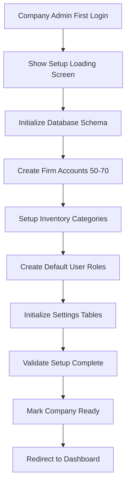
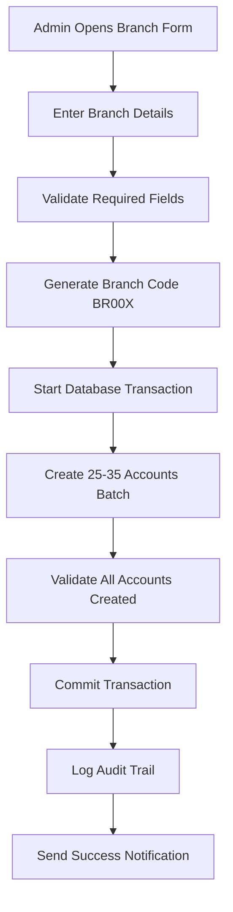

# Business Requirements Document (BRD) v2.0
## EASY2-LAUNDRY Enterprise Management System

**Document Version:** 2.0  
**Date:** December 19, 2025  
**Project:** EASY2-LAUNDRY Super Module Enterprise Suite  
**Industry:** Laundry & Dry Cleaning Services  
**Current Status:** Firebase v1.0 → **Enhanced Firebase/Firestore v2.0 (Migration-Ready for v3/v4)**  
**Future Versions:** v3/v4 will migrate to Node.js + MySQL with REST APIs  
**New Modules:** Accounting, Inventory, Van Seller Management, Advanced Analytics  

---

## 📋 VERSION COMPARISON MATRIX

| **BRD v1.0 Sections** | **Status in v2.0** | **Changes** |
|----------------------|-------------------|-------------|
| [1. Business Context](#1-business-context) | 🔄 **UPDATED** | Enhanced with enterprise features, multi-location operations |
| [2. Current Admin Modules](#2-current-admin-modules-v10) | 🔄 **UPDATED** | Enhanced with new features, performance improvements |
| [3. Future Modules Vision](#3-future-modules-super-module-vision) | ✅ **COMPLETED** | All modules now implemented in v2.0 using Firestore |
| [4. Migration Strategy](#4-migration-strategy-firebase--nodejs--mysql) | 🔄 **PLANNED** | v2.0 designed migration-ready for v3/v4 (Node.js + MySQL) |
| [5. Non-Functional Requirements](#5-non-functional-requirements) | 🔄 **ENHANCED** | Added enterprise-grade requirements |
| [6. Security Requirements](#6-security-requirements) | 🆕 **NEW** | Dedicated security section for enterprise |
| **[6. RBAC System](#6-dynamic-role-based-access-control-rbac-)** | 🆕 **NEW** | Complete access control (Firestore-based) |
| **[7. Accounting Module](#7-accounting--financial-management-)** | 🆕 **NEW** | Complete accounting system (Firestore-based) |
| **[8. Inventory Management](#8-inventory-management-system-)** | 🆕 **NEW** | Stock tracking and procurement (Firestore-based) |
| **[9. Van Seller Management](#9-van-seller-management-system-)** | 🆕 **NEW** | Mobile sales force tracking (Firestore-based) |
| **[10. Advanced Reporting](#10-advanced-reporting--analytics-)** | 🆕 **NEW** | P&L Analysis, financial reports (Firestore-based) |
| **[11. Invoice & Cash Memo](#11-invoice--cash-memo-system-)** | 🆕 **NEW** | Professional billing system (Firestore-based) |

---

## 📚 DOCUMENT NAVIGATION

**� Related Documents:**
- **[TechnicalDoc v2.0](TechnicalDoc_v2.md)** - Implementation guide with code examples
- **[DatabaseInfo v2.0](DatabaseInfo_v2.md)** - Database schemas for MySQL + enhanced Firebase
- **[TaskList v2.0](TaskList_v2.md)** - Implementation tasks with status tracking

**🔗 Bidirectional Cross-References:**
| BRD v2.0 Section | TechnicalDoc v2.0 Section | DatabaseInfo v2.0 Section | TaskList v2.0 Section |
|------------------|---------------------------|---------------------------|----------------------|
| [1. Business Context](#1-business-context) | [1. Enhanced Tech Stack](TechnicalDoc_v2.md#1-enhanced-tech-stack) | [1. Overview](DatabaseInfo_v2.md#1-overview) | [1. Foundation](TaskList_v2.md#1-foundation---firebase-enhancement-phase) |
| [2. Current Admin Modules](#2-current-admin-modules-v10) | [3. Enhanced Frontend](TechnicalDoc_v2.md#3-enhanced-frontend-components) | [2. Enhanced Firebase](DatabaseInfo_v2.md#2-enhanced-firebase-collections) | [4. Frontend](TaskList_v2.md#4-frontend-enhancement-phase) |
| [6. RBAC System](#6-dynamic-role-based-access-control-rbac-) | [10. Enhanced Roles](TechnicalDoc_v2.md#10-enhanced-roles-management) | [2.4 User Collections](DatabaseInfo_v2.md#24-enhanced-user-management-collections) | [1.4 RBAC](TaskList_v2.md#14-enhanced-rbac-security-rules) |
| [7. Accounting & Financial Management](#7-accounting--financial-management-) | [6. Accounting Logic](TechnicalDoc_v2.md#6-accounting-business-logic) | [2.1 Accounting Collections](DatabaseInfo_v2.md#21-accounting-collections) | [1.1 Accounting Collections](TaskList_v2.md#11-firebase-collections-design--enhancement) |
| [8. Inventory Management](#8-inventory-management-system-) | [7. Inventory Logic](TechnicalDoc_v2.md#7-inventory-management-logic) | [2.2 Inventory Collections](DatabaseInfo_v2.md#22-inventory-collections) | [1.2 Inventory Collections](TaskList_v2.md#11-firebase-collections-design--enhancement) |
| [9. Van Seller Management](#9-van-seller-management-system-) | [16. Van Seller Logic](TechnicalDoc_v2.md#11-van-seller-management-logic) | [8. Van Seller Tables](DatabaseInfo_v2.md#8-van-seller-management-tables-) | [7. Van Seller Implementation](TaskList_v2.md#7-van-seller-management-system-implementation-) |
| [10. Advanced Reporting](#10-advanced-reporting--analytics-) | [15. Advanced Reporting](TechnicalDoc_v2.md#15-advanced-reporting--analytics-logic) | [2.3 Analytics Collections](DatabaseInfo_v2.md#23-dashboard--analytics-collections) | [4.2 Analytics](TaskList_v2.md#42-advanced-reporting--analytics-tab) |
| [11. Invoice & Cash Memo](#11-invoice--cash-memo-system-) | [17. Invoice System](TechnicalDoc_v2.md#12-invoice--cash-memo-system) | [9. Invoice Tables](DatabaseInfo_v2.md#9-invoice--cash-memo-tables-) | [8. Invoice Implementation](TaskList_v2.md#8-invoice--cash-memo-system-implementation-) |

**�🔗 Cross-Version References:**
- **[BRD v1.0](BRD.md)** - Original Firebase-based requirements
- **[Technical Documentation](TechnicalDoc.md)** - Current implementation details
- **[Database Information](DatabaseInfo.md)** - Schema evolution from Firebase to MySQL

**📋 Quick Links by Module:**
| Module | BRD v1.0 Reference | New in v2.0 | Priority | Type |
|--------|-------------------|-------------|----------|------|
| [Dashboard](#21-dashboard--analytics-) | [BRD v1.0 → 2.1](BRD.md#21-dashboard--analytics-) | Enhanced P&L widgets | High | Main |
| [Order Management](#22-order-management-system-oms---core-) | [BRD v1.0 → 2.2](BRD.md#22-order-management-system-oms---core-) | Inventory integration | High | Main |
| [Accounting](#7-accounting--financial-management-) | N/A | **NEW MODULE** | Critical | **Main** |
| [Inventory](#8-inventory-management-system-) | N/A | **NEW MODULE** | Critical | **Main** |
| [Van Seller](#9-van-seller-management-system-) | N/A | **NEW MODULE** | High | **Main** |
| [Reporting](#10-advanced-reporting--analytics-) | [BRD v1.0 → 2.9](BRD.md#29-advanced-analytics-) | P&L Analysis | High | Sub-module |
| [Invoice/Cash Memo](#11-invoice--cash-memo-system-) | N/A | **NEW SUB-MODULE** | High | **Sub-module** (Billing) |

---

## 📈 EXECUTIVE SUMMARY

### Evolution from v1.0 to v2.0

**v1.0 (Firebase) Achievements:**
- ✅ Complete order management system (15-stage workflow)
- ✅ Multi-tenant admin panel with role-based access
- ✅ Real-time analytics and reporting
- ✅ POS system with coupon management
- ✅ Geographic hierarchy (States → Areas → Clusters → Branches)

**v2.0 (Enhanced Firestore - Migration-Ready) New Capabilities:**
- 🆕 **Dynamic RBAC System:** Custom roles with granular module/sub-module permissions (Firestore)
- 🆕 **Accounting Module:** Complete financial management with journals, ledgers, P&L (Firestore)
- 🆕 **Inventory Management:** Stock tracking, procurement, supplier management (Firestore)
- 🆕 **Van Seller System:** Mobile sales force tracking with GPS, stock, outstanding payments (Firestore)
- 🆕 **Advanced Reporting:** P&L Analysis, financial ratios (Firestore)
- 🆕 **Professional Invoicing:** GST-compliant invoices, cash memos (Firestore)
- 🆕 **Role Management:** Dynamic role creation and permission assignment (Firestore)
- 🚀 **Migration-Ready Architecture:** All collections designed for easy v3/v4 migration to REST API + MySQL

**v3/v4 (Future - Node.js + MySQL with REST APIs):**
- 🔮 **REST API Layer:** Replace Firestore SDK calls with REST API endpoints
- 🔮 **MySQL Database:** Migrate Firestore collections to relational MySQL tables
- 🔮 **Node.js Backend:** Express.js server handling all business logic
- 🔮 **Same Features:** All v2.0 features maintained, just different backend
- 🔮 **Zero Downtime:** Gradual migration using dual-write strategy

### Business Impact

**Revenue Growth:**
- Van seller system enables expansion to new territories
- Inventory optimization reduces stockouts and overstocking
- Professional invoicing improves payment collection
- Accounting module enables better financial decision-making

**Operational Efficiency:**
- Real-time inventory tracking across all locations
- Automated accounting entries reduce manual work
- Van seller GPS tracking improves route optimization
- Integrated P&L analysis provides instant business insights

**Scalability:**
- Firestore distributed database supports complex queries with proper indexing
- Next.js frontend enables API integrations and SSR
- Modular architecture supports future expansions
- Migration path to REST API + MySQL in v3/v4 when needed

---

### 🚀 VERSION ARCHITECTURE STRATEGY

**v2.0 (Current - Firestore ONLY):**
```
Next.js Frontend → Firebase SDK → Firestore Database
```
- ✅ All modules use Firestore collections directly
- ✅ Real-time listeners for live updates
- ✅ Firebase Authentication for security
- ✅ No REST API, no Node.js backend, no MySQL
- ✅ Migration-ready document structure with v3/v4 metadata fields

**v3.0 (Future - REST API + Firestore):**
```
Next.js Frontend → REST API (Node.js/Express) → Firestore Database
```
- 🔮 Replace Firebase SDK calls with REST API endpoints
- 🔮 Backend validation and business logic
- 🔮 Same Firestore database, different access method
- 🔮 Gradual migration: dual-write strategy

**v4.0 (Future - REST API + MySQL):**
```
Next.js Frontend → REST API (Node.js/Express) → MySQL Database
```
- 🔮 Migrate Firestore collections to MySQL tables
- 🔮 Complex SQL queries for advanced reporting
- 🔮 ACID transactions for accounting
- 🔮 Same REST APIs, different database backend

**Key Point:** v2.0 remains pure Firestore. Migration happens in v3/v4, not now.

---

## 1. BUSINESS CONTEXT

### 1.1 Industry Evolution: From Single Location to Enterprise

**v1.0 Context:** Single/multi-branch laundry operations with basic admin panel

**v2.0 Context:** Enterprise laundry chains with:
- **Multiple Locations:** Centralized management of 10-50 branches
- **Mobile Sales Force:** Van sellers expanding market reach
- **Professional Accounting:** GST compliance, financial reporting
- **Inventory Optimization:** Centralized procurement and stock management
- **Advanced Analytics:** Real-time P&L, cash flow, profitability analysis

### 1.2 Business Objectives v2.0

1. **Enterprise Access Control:** Dynamic RBAC with custom roles and granular permissions
2. **Financial Excellence:** Complete accounting system with real-time P&L
3. **Inventory Intelligence:** Zero stockouts, optimal stock levels
4. **Mobile Sales Expansion:** Track and manage van seller operations
5. **Professional Billing:** GST-compliant invoices and payment tracking
6. **Enterprise Reporting:** Comprehensive financial and operational analytics

### 1.3 Success Metrics v2.0

**Financial Metrics:**
- Accounting accuracy: 100% (automated journal entries)
- Inventory turnover: 12x annually (industry benchmark)
- Payment collection: 95% within 30 days
- Van seller productivity: 20% increase

**Operational Metrics:**
- Order processing: < 1 minute from POS to confirmation
- Inventory accuracy: 99.9%
- System uptime: 99.95%
- Mobile app performance: < 2 second response time

---

## 2. CURRENT ADMIN MODULES (v1.0) - ENHANCED IN v2.0

> **🔄 Enhanced from BRD v1.0:** All existing modules updated with new features

---

### 2.1 Dashboard & Analytics 🔄 ENHANCED
**Status:** Enhanced with P&L widgets and financial KPIs  
**File Location:** `/src/app/admin/dashboard/page.js`

**New v2.0 Features:**
- **P&L Summary Widget:** Real-time profit/loss display
- **Cash Flow Indicator:** Daily cash position tracking
- **Top Performing Branches:** Revenue and profit rankings
- **Inventory Alerts:** Low stock warnings across locations
- **Van Seller Performance:** Sales targets vs actual

**📋 Updates from v1.0:**
- Added financial KPIs alongside operational metrics
- Integrated with accounting module for real-time P&L
- Enhanced date filtering with fiscal year support

---

### 2.2 Order Management System (OMS) 🔄 ENHANCED
**Status:** Integrated with inventory and accounting  
**File Location:** `/src/app/admin/orders/page.js`

**New v2.0 Features:**
- **Inventory Deduction:** Automatic stock reduction on order completion
- **Accounting Integration:** Auto-create sales journal entries
- **GST Calculation:** Automatic tax computation and recording
- **Payment Tracking:** Enhanced with payment method analytics
- **Branch Profitability:** Track revenue by branch/location

**📋 Updates from v1.0:**
- Added inventory integration for stock management
- Enhanced with accounting journal entries
- Added GST compliance features

---

### 2.3 Product Management 🔄 ENHANCED
**Status:** Fully integrated with inventory management system
**File Location:** `/src/app/admin/products/`

**New v2.0 Features:**
- **Unified Product + Inventory Creation:** Single form creates both product and inventory records
- **Price Management:** Selling price, purchase price, discount percentage (two-digit format)
- **Inventory Integration:** Automatic stock tracking, reorder points, location management
- **Supplier Linking:** Connect products to suppliers for procurement
- **Profit Margin Analysis:** Automatic calculations based on cost vs selling prices

**Product Model Fields:**
- ✅ **Selling Price:** Price charged to customers
- ✅ **Purchase Price:** Latest purchase cost (synced from inventory)
- ✅ **Discount Percentage:** Two-digit format (12.00 for 12%)
- ✅ **Category/Subcategory:** Product organization
- ✅ **Description/Images:** Product details

**Inventory Model Fields (Auto-Created):**
- ✅ **Stock Quantity:** Current stock levels by location
- ✅ **Reorder Point:** Minimum stock level alerts
- ✅ **Cost Price:** Current purchase price
- ✅ **Location:** Warehouse/branch assignment
- ✅ **Selling Price:** Synced from product model
- ✅ **Discount Percentage:** Synced from product model

**Creation Workflow:**
```
Add New Product Form
├── Product Information
│   ├── Name, Category, Selling Price, Purchase Price
│   ├── Discount %, Description, Images
│   └── Supplier Selection
└── Inventory Information
    ├── Initial Stock Quantity, Reorder Point
    ├── Location (Warehouse/Branch)
    └── Cost Price, Cost Method

[Save] → Creates both product and inventory records
```

**Price Synchronization:**
- **Purchase Price:** Updated in inventory on stock receipts → auto-syncs to product
- **Selling Price:** Set in product model → syncs to inventory
- **Discount %:** Consistent across both models

**Integration Benefits:**
- ✅ **Seamless Workflow:** One form for complete product setup
- ✅ **Real-time Stock:** Inventory levels updated automatically
- ✅ **Cost Tracking:** Purchase price history maintained
- ✅ **Supplier Management:** Direct links to procurement process
- ✅ **Accounting Ready:** Cost data flows to financial reports

---

### 2.4 User Management & Dynamic RBAC 🔄 ENHANCED
**Status:** Complete overhaul with dynamic role-based access control  
**File Location:** `/src/app/admin/users/page.js` + New `/src/app/admin/roles/`

**New v2.0 Features:**
- **Dynamic Role Creation:** Custom roles instead of static roles
- **Module-Based Permissions:** Left menu items as modules with read/write access
- **Sub-Module Permissions:** Tabs within modules with granular access control
- **Protected System Roles:** company_admin role cannot be modified or deleted
- **Role Assignment:** Users assigned to roles, roles control all permissions

**Dynamic Role Structure:**
```javascript
// Custom Role Definition
{
  name: "Branch Manager",
  description: "Manages branch operations with limited access",
  isSystemRole: false, // Cannot be deleted/modified if true
  permissions: {
    dashboard: { read: true, write: false },
    analytics: { 
      read: true, 
      write: false,
      subModules: {
        sales: { read: true, write: false },
        orders: { read: true, write: false },
        branches: { read: true, write: false }
      }
    },
    orders: { read: true, write: true },
    products: { read: true, write: false },
    // ... other modules
  }
}
```

**Module Hierarchy (Left Menu + Sub-modules):**

**Main Modules (Left Menu Items):**
1. **dashboard** - Main dashboard (read/write)
2. **analytics** - Business intelligence
   - *Sub-modules: sales, orders, branches, customers, losses, **advanced-reporting***
3. **billing** - POS system (read/write)
   - *Sub-modules: **invoice-system, cash-memo***
4. **orders** - Order management (read/write)
5. **products** - Product catalog
   - *Sub-modules: categories, products, subcategories*
6. **inquiries** - Customer support (read/write)
7. **users** - User management (read/write)
   - *Sub-modules: **role-management***
8. **coupons** - Discount management (read/write)
9. **areas** - Geographic setup (read/write)
10. **branches** - Branch management (read/write)
11. **settings** - System configuration (read/write)
12. **🆕 accounting** - Financial management (read/write)
13. **🆕 inventory** - Stock management (read/write)
14. **🆕 van-seller** - Mobile sales force (read/write)

**Sub-Module Permissions:**
- **Analytics sub-modules:** sales, orders, branches, customers, losses, advanced-reporting
- **Products sub-modules:** categories, products, subcategories
- **Users sub-modules:** role-management
- **Billing sub-modules:** invoice-system, cash-memo

**Permission Levels:**
- **Read Access:** View data, reports, export/print
- **Write Access:** Create, edit, delete, modify settings
- **Sub-Module Access:** Granular control within complex modules

**System Role Protection:**
- **company_admin:** Full access, cannot be modified/deleted
- **Custom Roles:** Can be created, modified, deleted by company_admin
- **Role Inheritance:** Write access includes read access automatically

**Migration from Static to Dynamic:**
- Convert existing static roles to dynamic roles
- Preserve current permission matrix
- Gradual user migration to role-based system

---

### 2.5 Geographic Management 🔄 ENHANCED
**Status:** Integrated with delivery zones and pricing  
**File Location:** `/src/app/admin/areas/page.js`

**New v2.0 Features:**
- **Delivery Zone Pricing:** Different rates by geographic area
- **Van Seller Territories:** Assign areas to van sellers
- **Distance Calculation:** Integration with mapping services

---

### 2.6 Coupon Management 🔄 ENHANCED
**Status:** Financial impact tracking  
**File Location:** `/src/app/admin/coupons/page.js`

**New v2.0 Features:**
- **Revenue Impact:** Track discount impact on profitability
- **Usage Analytics:** Coupon performance by branch/location

---

### 2.7 Billing/POS 🔄 ENHANCED
**Status:** Major enhancement to unified order creation, billing, and invoicing system  
**File Location:** `/src/app/admin/billing/page.js`

**New v2.0 Features:**
- **Unified Transaction Types:** New Order (job card), Cash Sale (immediate payment), Credit Invoice (deferred payment)
- **Smart Order Handling:** Creates new orders or updates existing orders based on order ID
- **WhatsApp Integration:** Forward job cards to customer mobile numbers
- **Payment Status Tracking:** Paid, unpaid, partial paid
- **Order Fetching:** Pull existing orders by ID for billing/invoicing
- **Accounting Integration:** Transaction categorization for financial recording

**POS Transaction Types:**

**1. Pre-Order (Job Card) - Order Creation:**
- **Purpose:** Create orders without immediate payment (laundry submission)
- **Order Status:** Always "pending" initially
- **Features:**
  - Customer details and item selection
  - Estimated pricing and service selection
  - **Job Card Receipt:** Printable receipt with order details
  - **WhatsApp Forwarding:** Option to redirect to WhatsApp with job card details (no API required, browser redirect)
  - **Business Type Flexibility:** Adapt job card format based on business type (laundry, retail, etc.)
- **Workflow:**
  1. Select "New Order" from dropdown
  2. Add customer and items
  3. Click "Place Order" button
  4. Generate and print job card
  5. Optional: Forward to customer's WhatsApp

**2. Bill (Cash Transaction) - Immediate Payment:**
- **Purpose:** Direct billing or fetch existing order for immediate payment
- **Payment Status:** Marked as "paid"
- **Features:**
  - Direct item addition or order ID lookup
  - Payment method tracking (cash, online, card)
  - Automatic receipt generation
  - No credit/debit accounting (cash transaction)
- **Workflow:**
  1. Select "Cash Sale" from dropdown
  2. Add items directly or fetch by order ID (updates existing order if ID provided)
  3. Click "Generate Bill" button
  4. Process payment (cash/online/card)
  5. Generate receipt, mark as paid

**3. Invoice (Credit Transaction) - Deferred Payment:**
- **Purpose:** Create credit invoices for unpaid orders or new credit sales
- **Payment Status:** "unpaid" or "partial paid"
- **Terminology:** "Invoice" creates accounts receivable (customer owes money)
- **Features:**
  - Fetch unpaid orders by ID
  - Create new invoices by adding products
  - Due date and payment terms
  - GST-compliant invoice generation
  - Accounting integration for credit tracking
- **Workflow:**
  1. Select "Credit Invoice" from dropdown
  2. Fetch existing unpaid order or add new items (updates existing order if ID provided)
  3. Click "Generate Invoice" button
  4. Set payment terms and due date
  5. Generate invoice, mark as credit transaction

**POS Interface Enhancements:**
- **Transaction Type Dropdown:** New Order, Cash Sale, Credit Invoice
- **Customer Management in POS:**
  - **Direct Customer Creation:** Add new customers directly in POS with unique name validation
  - **Seamless Accounting Integration:** Customer creation in POS automatically creates receivable account under Accounts Receivable (MAIN-1003)
  - **No Separate Accounting Step:** Eliminates need to create customer accounts in accounting module
  - **Automatic Account Code:** System generates CUST-[ID] and places under receivable parent
  - **Credit Sale Ready:** New POS customers can immediately be used for credit transactions

**Customer Creation Workflow in POS:**
1. During any transaction (New Order, Cash Sale, Credit Invoice)
2. Click "Add New Customer" or search existing
3. Enter customer mobile number (unique constraint - primary identifier)
4. Enter customer name (can be duplicate, used for display)
5. Add additional details (address, email)
6. Set credit limit (optional, default $100)
7. System automatically:
   - Validates unique mobile number
   - Creates customer master record
   - Creates receivable account as child under MAIN-1003
   - Generates unique CUST-[ID] code based on mobile
   - Links account to customer profile
8. Customer immediately available for credit transactions

**Customer Identification Rules:**
- **Primary Key:** Mobile number (unique constraint)
- **Display Name:** Customer name (can be duplicate)
- **Search Options:** Search by mobile, name, or account code
- **Duplicate Prevention:** Same mobile number cannot be registered twice
- **Business Logic:** Mobile number required for WhatsApp forwarding, SMS notifications

**Benefits:**
- ✅ **Streamlined Workflow:** No separate accounting module visits needed
- ✅ **Real-time Account Creation:** Accounting ledger updated instantly
- ✅ **Operational Efficiency:** Cashiers can create customers on-the-spot
- ✅ **Accounting Integrity:** Proper receivable accounts created automatically
- ✅ **Duplicate Prevention:** Unique name validation prevents duplicates
- **Action Buttons:** 
  - New Order → "Place Order" button
  - Cash Sale → "Generate Bill" button  
  - Credit Invoice → "Generate Invoice" button
- **Order Behavior:** 
  - **New Order ID:** Creates new order entry
  - **Existing Order ID:** Updates existing order (no duplicate creation)
- **Order Search:** Quick lookup by order ID or customer phone
- **Payment Method Selection:** Cash, Card, Online, UPI, etc.
- **Receipt/Invoice Generation:** Customizable templates
- **WhatsApp Integration:** Direct browser redirect for job card sharing

**Order Payment Status Tracking:**
- **paid:** Full payment received (cash transactions)
- **unpaid:** Invoice created, payment pending (credit transactions)
- **partial paid:** Partial payment on credit invoice
- **Integration:** Status updates trigger accounting journal entries

**Accounting Dimensions (Future Integration):**
- **Cash Transactions:** Direct revenue recognition (Cash Sale)
- **Credit Transactions:** Accounts receivable tracking (Credit Invoice)
- **Customer Ledger:** Individual customer payment history
- **GST Compliance:** Tax calculations and reporting

**📋 Updates from v1.0:**
- Transformed from simple POS to comprehensive transaction management
- Added pre-order capabilities for order creation phase
- Integrated invoice generation for credit sales
- Enhanced with WhatsApp forwarding for job cards
- Added payment status tracking for accounting integration

**Business Impact:**
- **Unified Workflow:** Single system for order creation, billing, and invoicing
- **Customer Convenience:** WhatsApp job card forwarding
- **Financial Control:** Clear separation of cash vs credit transactions
- **Accounting Ready:** Payment status tracking for journal entries

---

### 2.8 Customer Inquiries ✅ UNCHANGED
**Status:** Core functionality maintained  
**File Location:** `/src/app/admin/inquiries/page.js`

---

### 2.9 Advanced Analytics 🔄 ENHANCED
**Status:** Expanded with financial analytics  
**File Location:** `/src/app/admin/analytics/page.js`

**New v2.0 Features:**
- **P&L Analysis Tab:** Complete profit & loss reporting
- **Financial Ratios:** Gross margin, net profit margin
- **Trend Analysis:** Month-over-month financial performance

---

### 2.10 Settings 🔄 ENHANCED
**Status:** Added accounting and inventory settings  
**File Location:** `/src/app/admin/settings/page.js`

**New v2.0 Features:**
- **Accounting Settings:** GST rates, fiscal year configuration
- **Inventory Settings:** Stock alert thresholds, reorder points
- **Van Seller Settings:** Commission rates, target configurations

---

## 3. NEW ENTERPRISE MODULES (v2.0)

---

## 6. DYNAMIC ROLE-BASED ACCESS CONTROL (RBAC) 🆕 NEW

### 6.1 Overview
**Purpose:** Enterprise-grade access control with default roles that can be customized

### 6.2 Default Roles (Static but Customizable)

**System Roles (Protected from Deletion):**
- **company_admin:** Full access, cannot be deleted or have role name changed
- **general_manager:** Limited admin access
- **branch_manager:** Branch-specific management
- **cashier:** POS and billing access
- **delivery_man:** Delivery operations
- **pickup_man:** Pickup operations

**Customization Rules:**
- ✅ **Can modify permissions:** Add or reduce module access for default roles
- ✅ **Can change descriptions:** Update role descriptions
- ✅ **Cannot delete:** Default roles cannot be removed
- ✅ **Cannot rename:** Role values (company_admin, etc.) cannot be changed
- ✅ **Can create new roles:** Additional custom roles beyond defaults

### 6.3 Current Role-Module Access Matrix

| Module | company_admin | general_manager | branch_manager | cashier | delivery_man | pickup_man |
|--------|---------------|-----------------|----------------|---------|--------------|------------|
| **dashboard** | ✅ | ✅ | ✅ | ❌ | ❌ | ❌ |
| **analytics** | ✅ | ✅ | ❌ | ❌ | ❌ | ❌ |
| **billing** | ✅ | ✅ | ✅ | ✅ | ❌ | ❌ |
| **orders** | ✅ | ✅ | ✅ | ✅ | ✅ | ✅ |
| **products** | ✅ | ✅ | ✅ | ❌ | ❌ | ❌ |
| **inquiries** | ✅ | ✅ | ✅ | ❌ | ❌ | ❌ |
| **users** | ✅ | ✅ | ❌ | ❌ | ❌ | ❌ |
| **coupons** | ✅ | ✅ | ✅ | ❌ | ❌ | ❌ |
| **areas** | ✅ | ✅ | ❌ | ❌ | ❌ | ❌ |
| **branches** | ✅ | ✅ | ❌ | ❌ | ❌ | ❌ |
| **settings** | ✅ | ✅ | ❌ | ❌ | ❌ | ❌ |
| **accounting** | ✅ | ✅ | ❌ | ❌ | ❌ | ❌ |
| **inventory** | ✅ | ✅ | ✅ | ❌ | ❌ | ❌ |
| **van_seller** | ✅ | ✅ | ✅ | ❌ | ❌ | ❌ |

### 6.4 Permission Enhancement Strategy

**From Static to Dynamic:**
1. **Preserve Current Access:** Default roles start with current permissions
2. **Add Granularity:** Introduce read/write permissions per module
3. **Sub-Module Control:** Analytics tabs, Product sub-pages, etc.
4. **Flexible Customization:** Admin can adjust permissions without code changes

**Permission Levels per Module:**
- **Read Access:** View data, export/print, basic navigation
- **Write Access:** Create, edit, delete, modify settings
- **No Access:** Module hidden from navigation

### 6.5 Default Role Permissions (Detailed)

**company_admin (Full Access):**
```javascript
{
  name: "Company Admin",
  isSystemRole: true,
  permissions: {
    dashboard: { read: true, write: true },
    analytics: { read: true, write: true },
    billing: { read: true, write: true },
    orders: { read: true, write: true },
    products: { read: true, write: true },
    inquiries: { read: true, write: true },
    users: { read: true, write: true },
    coupons: { read: true, write: true },
    areas: { read: true, write: true },
    branches: { read: true, write: true },
    settings: { read: true, write: true },
    accounting: { read: true, write: true },
    inventory: { read: true, write: true },
    van_seller: { read: true, write: true }
  }
}
```

**general_manager (Limited Admin):**
```javascript
{
  name: "General Manager",
  isSystemRole: true,
  permissions: {
    dashboard: { read: true, write: true },
    analytics: { read: true, write: true },
    billing: { read: true, write: true },
    orders: { read: true, write: true },
    products: { read: true, write: true },
    inquiries: { read: true, write: true },
    users: { read: true, write: false }, // Can view but not modify users
    coupons: { read: true, write: true },
    areas: { read: true, write: true },
    branches: { read: true, write: true },
    settings: { read: true, write: true },
    accounting: { read: true, write: true },
    inventory: { read: true, write: true },
    van_seller: { read: true, write: true }
  }
}
```

**branch_manager (Branch Operations):**
```javascript
{
  name: "Branch Manager",
  isSystemRole: true,
  permissions: {
    dashboard: { read: true, write: false },
    analytics: { read: false, write: false },
    billing: { read: true, write: true },
    orders: { read: true, write: true },
    products: { read: true, write: false },
    inquiries: { read: true, write: true },
    users: { read: false, write: false },
    coupons: { read: true, write: false },
    areas: { read: false, write: false },
    branches: { read: false, write: false },
    settings: { read: false, write: false },
    accounting: { read: false, write: false },
    inventory: { read: true, write: true },
    van_seller: { read: true, write: true }
  }
}
```

**cashier (POS Operations):**
```javascript
{
  name: "Cashier",
  isSystemRole: true,
  permissions: {
    dashboard: { read: false, write: false },
    analytics: { read: false, write: false },
    billing: { read: true, write: true },
    orders: { read: true, write: true },
    products: { read: false, write: false },
    inquiries: { read: false, write: false },
    users: { read: false, write: false },
    coupons: { read: false, write: false },
    areas: { read: false, write: false },
    branches: { read: false, write: false },
    settings: { read: false, write: false },
    accounting: { read: false, write: false },
    inventory: { read: false, write: false },
    van_seller: { read: false, write: false }
  }
}
```

**delivery_man & pickup_man (Field Operations):**
```javascript
{
  name: "Delivery Man", // or "Pickup Man"
  isSystemRole: true,
  permissions: {
    dashboard: { read: false, write: false },
    analytics: { read: false, write: false },
    billing: { read: false, write: false },
    orders: { read: true, write: false }, // Can view assigned orders
    products: { read: false, write: false },
    inquiries: { read: false, write: false },
    users: { read: false, write: false },
    coupons: { read: false, write: false },
    areas: { read: false, write: false },
    branches: { read: false, write: false },
    settings: { read: false, write: false },
    accounting: { read: false, write: false },
    inventory: { read: false, write: false },
    van_seller: { read: false, write: false }
  }
}
```

### 6.6 RBAC Management Interface

**Role Management Features:**
- View all default + custom roles
- Modify permissions for default roles (cannot delete)
- Create new custom roles
- Assign users to roles
- Permission matrix with checkboxes
- Real-time permission preview

**Permission Modification Rules:**
- company_admin can modify all role permissions
- Cannot remove permissions from company_admin role
- Changes apply immediately to all users with that role
- Audit log of all permission changes

### 6.7 Migration Strategy

**Phase 1: Database Setup**
- Create roles, permissions, role_permissions collections
- Import default roles with current permissions
- Set company_admin as system role

**Phase 2: User Migration**
- Update existing users to reference role IDs instead of static role strings
- Preserve current access levels
- Enable permission caching

**Phase 3: Dynamic Access**
- Replace static role checks with dynamic permission checks
- Update AdminSidebar to use permission-based filtering
- Enable role management interface

### 6.8 Integration Points
- **AdminSidebar:** Dynamic menu filtering based on permissions
- **All Modules:** Permission checks before rendering components
- **User Management:** Role assignment interface
- **Audit System:** Track permission changes

---

## 7. ACCOUNTING & FINANCIAL MANAGEMENT 🆕 NEW

### 7.1 Overview
**Purpose:** Simplified double-entry accounting system for small/medium businesses with automated common transactions and manual control for complex entries. Pure accounting principles with user-friendly automation.

### 7.2 Accounting Philosophy
**Simplified for Small Businesses:**
- **Automated Common Transactions:** 80% of daily transactions auto-recorded
- **Manual Complex Entries:** Accountant control for adjustments and special transactions
- **Branch Accounting:** Automatic account creation for branches and van sellers
- **Real-Time Financial Tracking:** Customer receivables, supplier payables, profit/loss
- **Balance Sheet Integrity:** Assets = Liabilities + Equity maintained automatically

### 7.3 Automatic Account Creation - TIMING & TRIGGERS

#### **� FIRM/COMPANY ACCOUNTS - SYSTEM SETUP TRIGGER**

**WHEN: Company Admin logs in for the first time**
```
TRIGGER: First login after Super Admin creates company
PROCESS:
├── Show loading screen: "Setting up your company..."
├── Run company initialization script
├── Create 50-70 core company accounts
├── Initialize other modules (inventory, users, settings)
├── Set default configurations
├── Mark company as "initialized"
└── Redirect to dashboard
```

**Setup Process Flow:**


**What Gets Initialized:**
- ✅ **Accounting:** 35-40 core firm accounts (MAIN-1001, etc.)
- ✅ **Inventory:** Categories, units, warehouses
- ✅ **Users:** Default roles, permissions matrix
- ✅ **Settings:** Company info, tax settings, preferences
- ✅ **Reports:** Default report templates
- ✅ **Coupons:** System coupon categories

#### **📋 DETAILED CORE ACCOUNTS CREATED (35-40 Accounts):**

**🏦 ASSETS (1000-1999) - 12 Accounts:**
```
MAIN-1001: Cash in Hand
MAIN-1002: Bank Account - Primary
MAIN-1003: Accounts Receivable
MAIN-1004: Inventory
MAIN-1005: Prepaid Expenses
MAIN-1006: GST Input Tax Credit
MAIN-1201: Furniture & Fixtures
MAIN-1202: Equipment
MAIN-1203: Vehicles
MAIN-1204: Buildings
MAIN-1205: Accumulated Depreciation
MAIN-1206: Land
```

**💰 LIABILITIES (2000-2999) - 8 Accounts:**
```
MAIN-2001: Accounts Payable
MAIN-2002: GST Payable
MAIN-2003: Salaries Payable
MAIN-2004: Utilities Payable
MAIN-2005: Loans Payable - Short Term
MAIN-2101: Loans Payable - Long Term
MAIN-2102: Owner's Loan
MAIN-2103: Deferred Tax Liability
```

**🎯 EQUITY (3000-3999) - 5 Accounts:**
```
MAIN-3001: Owner's Capital
MAIN-3002: Retained Earnings
MAIN-3003: Current Year Profit/Loss
MAIN-3004: Opening Balance Equity
MAIN-3005: Drawings
```

**💵 INCOME (4000-4999) - 6 Accounts:**
```
MAIN-4001: Sales Revenue
MAIN-4002: Service Income
MAIN-4003: Other Income
MAIN-4004: Interest Income
MAIN-4005: Discount Received
MAIN-4006: Late Payment Fees
```

**💸 EXPENSES (5000-5999) - 8 Accounts:**
```
MAIN-5001: Cost of Goods Sold
MAIN-5101: Salaries & Wages
MAIN-5102: Utilities
MAIN-5103: Rent
MAIN-5104: Insurance
MAIN-5105: Repairs & Maintenance
MAIN-5106: Advertising & Marketing
MAIN-5107: Office Supplies
```

**Account Codes:** MAIN-XXXX format (no branch prefix)

**WHEN: New account types needed**
```
TRIGGER: Admin adds new revenue stream or expense category
PROCESS:
├── Manual account creation request
├── Approval workflow (accountant approval required)
├── Create account with MAIN- prefix
├── Add to chart of accounts
└── Update reporting templates
```

#### **🆕 HIERARCHICAL ACCOUNT CREATION - PURE TRADITIONAL ACCOUNTING**

**YES - Complete Hierarchical Account Structure for Professional Accountants:**

**Traditional Accounting Book Structure Support:**
```
ASSETS
├── Current Assets
│   ├── Cash in Hand
│   ├── Bank Accounts
│   │   ├── HDFC Current
│   │   ├── SBI Savings
│   │   └── BOB CC
│   ├── Accounts Receivable
│   │   ├── Customer A
│   │   └── Customer B
│   └── Inventory
│       ├── Main Warehouse
│       └── Branch Warehouse

LIABILITIES
├── Current Liabilities
│   ├── Accounts Payable
│   │   ├── Supplier X
│   │   └── Supplier Y
│   └── Loans Payable
│       ├── HDFC Loan
│       └── SBI Loan
```

### **🎯 Account Creation Levels:**

**1. 🏠 Main Accounts (Parents/Top-Level)**
- Asset, Liability, Income, Expense, Equity categories
- Can have children or be standalone
- Examples: Assets, Liabilities, Bank Accounts, Accounts Receivable

**2. 👶 Child Accounts (Sub-Accounts)**
- Accounts under main accounts
- Examples: HDFC Current (under Bank Accounts), Customer A (under Accounts Receivable)

**3. 👶👶 Sub-Accounts (Children of Children)**
- Multi-level hierarchy support
- Examples: HDFC Interest Account (under HDFC Current)

### **🔧 Enhanced Account Creation Interface:**

#### **Step 1: Choose Account Level**
```
Create New Account
├── ⃝ Main Account (creates parent/top-level category)
├── ⃝ Child Account (creates under existing parent)
└── ⃝ Sub-Account (creates under child account)
```

#### **Step 2: Dynamic Form Based on Selection**

##### **For Main Account Creation:**
```javascript
Account Level: Main Account
Account Type: [Asset ▼]  // Asset, Liability, Income, Expense, Equity
├── Asset (1000-1999)
├── Liability (2000-2999)
├── Income (4000-4999)
├── Expense (5000-5999)
└── Equity (3000-3999)

Traditional Classification: [Real ▼]  // Auto-selected based on Account Type
├── Real (for Assets & Liabilities)
├── Personal (for some Assets, Liabilities & Equity)
└── Nominal (for Income & Expenses)

Account Classification: [Current Asset ▼]  // Based on selected Account Type
// For Assets:
├── Current Asset (1000-1099)
├── Fixed Asset (1200-1299)
// For Liabilities:
├── Current Liability (2000-2099)
├── Long-term Liability (2100-2199)
// For Income/Expense/Equity:
├── Operating (default)
├── Non-Operating
├── Exceptional

Account Name: Bank Accounts
Is Parent: [✓] Yes (allows children)
Account Code: MAIN-1002 (auto-generated based on type)
Category: Banking (sub-category for reporting)
Normal Balance: Debit (auto-set based on type)
GST Applicable: [No ▼]  // Yes/No
Opening Balance: 0.00 (optional)
```

**Account Type & Classification Rules:**
- **Asset Accounts:** Traditional = Real, Classification = Current/Fixed Asset
- **Liability Accounts:** Traditional = Real, Classification = Current/Long-term Liability  
- **Income Accounts:** Traditional = Nominal, Classification = Operating/Non-operating
- **Expense Accounts:** Traditional = Nominal, Classification = Operating/Non-operating
- **Equity Accounts:** Traditional = Personal, Classification = Owner's stake items
- **Auto-Validation:** Traditional classification auto-sets based on account type
- **Manual Override:** Advanced users can adjust for special cases
- **Reporting Impact:** Both modern and traditional classifications drive financial statements

##### **For Child Account Creation:**
```javascript
Account Level: Child Account
Parent Account: [Bank Accounts ▼]  // Dropdown of all parent accounts
├── Bank Accounts (1002)
├── Accounts Receivable (1003)
├── Inventory (1004)
└── [Other parent accounts...]

Account Name: HDFC Current Account
Bank Details: [Show bank fields]
├── Bank Name: HDFC Bank
├── Account Number: 1234567890
├── IFSC Code: HDFC0001234
└── Account Type: Current Account

Account Code: 1002-001 (auto-generated under parent)
GST Applicable: No
Opening Balance: 50000.00 (optional)
```

##### **For Sub-Account Creation:**
```javascript
Account Level: Sub-Account
Parent Account: [HDFC Current Account ▼]  // Can select child accounts too
Account Name: HDFC Interest Account
Account Code: 1002-001-001 (auto-generated)
GST Applicable: No
Opening Balance: 0.00
```

#### **Step 3: Auto-Generated Account Codes**

**Main Account Codes:** `MAIN-XXXX`
- Assets: MAIN-1000 to MAIN-1999
- Liabilities: MAIN-2000 to MAIN-2999
- Equity: MAIN-3000 to MAIN-3999
- Income: MAIN-4000 to MAIN-4999
- Expenses: MAIN-5000 to MAIN-5999

**Child Account Codes:** `ParentCode-XXX`
- Under MAIN-1002: 1002-001, 1002-002, 1002-003...
- Under MAIN-1003: 1003-001, 1003-002, 1003-003...

**Sub-Account Codes:** `ParentCode-XXX-YYY`
- Under 1002-001: 1002-001-001, 1002-001-002...

### **📚 Traditional Accounting Flexibility:**

**Accountants Can Create Any Structure:**
- ✅ **Multi-level hierarchies** (parent → child → grandchild)
- ✅ **Custom account names** and codes
- ✅ **Flexible categorization** (banking, operations, administration)
- ✅ **Industry-specific structures** (laundry, retail, manufacturing)
- ✅ **Regulatory compliance** (GST categories, tax accounts)

**Examples of Professional Account Structures:**

#### **Banking Hierarchy:**
```
MAIN-1002: Bank Accounts (Parent)
├── 1002-001: HDFC Current Account
│   └── 1002-001-001: HDFC Interest Income
├── 1002-002: SBI Savings Account
│   └── 1002-002-001: SBI Interest Income
└── 1002-003: BOB Credit Card
    └── 1002-003-001: BOB CC Interest Expense
```

#### **Customer Receivables Hierarchy:**
```
MAIN-1003: Accounts Receivable (Parent)
├── 1003-001: Customer A
│   ├── 1003-001-001: Customer A - Branch 1
│   └── 1003-001-002: Customer A - Branch 2
├── 1003-002: Customer B
└── 1003-003: Customer C
```

#### **Supplier Payables Hierarchy:**
```
MAIN-2001: Accounts Payable (Parent)
├── 2001-001: Supplier X
│   ├── 2001-001-001: Supplier X - Materials
│   └── 2001-001-002: Supplier X - Services
├── 2001-002: Supplier Y
└── 2001-003: Supplier Z
```

### **🔐 Approval Workflow:**

**For All Account Types:**
```
Accountant Request → Company Admin Review → Approval/Rejection → Account Creation → Audit Log
```

**Special Rules:**
- ✅ **Main Accounts:** Always require approval
- ✅ **Child Accounts:** Can be auto-approved if parent allows
- ✅ **Sub-Accounts:** Follow parent approval rules

### **✅ Validation Rules:**

- ✅ **Unique Codes:** No duplicate account codes in hierarchy
- ✅ **Proper Classification:** Account type matches parent category
- ✅ **Balance Sheet Integrity:** Assets = Liabilities + Equity maintained
- ✅ **GST Compliance:** Tax settings properly configured
- ✅ **Hierarchy Rules:** Children cannot exist without parents
- ✅ **Audit Trail:** All changes logged with user and timestamp

### **🎯 Benefits for Professional Accountants:**

#### **1. Traditional Accounting Freedom:**
- Create **any account structure** needed
- **Multi-level hierarchies** like physical accounting books
- **Flexible coding** system (MAIN-XXXX, XXX-XXX, XXX-XXX-XXX)

#### **2. Business Flexibility:**
- **Scale** from simple to complex structures
- **Adapt** to changing business needs
- **Migrate** existing account structures from manual books

#### **3. Industry Compliance:**
- **GST-ready** account structures
- **Regulatory** compliance for different industries
- **Audit-friendly** hierarchical organization

### **💼 Real-World Examples:**

**Laundry Business Structure:**
```
ASSETS
├── Bank Accounts
│   ├── HDFC Current
│   ├── SBI Savings
│   └── BOB CC
├── Accounts Receivable
│   ├── Regular Customers
│   └── Corporate Clients
└── Inventory
    ├── Cleaning Supplies
    └── Equipment Parts

LIABILITIES
├── Accounts Payable
│   ├── Chemical Suppliers
│   └── Equipment Vendors
└── Loans
    ├── HDFC Business Loan
    └── SBI Working Capital
```

**Integration with Existing System:**
- **Auto Journal Entries:** New accounts available in transaction dropdowns
- **Reporting:** Automatically included in financial reports with hierarchy
- **Export/Import:** Hierarchical account data exports
- **Backup:** Complete account structure backups

---

#### **🎯 AUTOMATIC ACCOUNT CREATION TIMING:**

**1. Branch Account Creation - IMMEDIATE TRIGGER**
```
WHEN: Admin clicks "Add New Branch" and saves branch details
PROCESS:
├── Validate branch info (name, location, manager)
├── Generate unique branch code (BR001, BR002, etc.)
├── Create 25-35 accounts in single transaction
├── Link all accounts to branch_id
└── Log creation audit trail
```

**Prerequisites:**
- Branch name, location, and manager must be provided
- Branch code must be unique in system
- Admin must have "Branch Management" permission
- Database connection must be active

**2. Van Seller Account Creation - IMMEDIATE TRIGGER**
```
WHEN: Admin clicks "Add New Van Seller" and saves profile
PROCESS:
├── Validate van seller info (name, area, commission rate)
├── Generate unique van seller code (VS001, VS002, etc.)
├── Create 5-8 accounts in single transaction
├── Set initial balances to zero
└── Link to assigned branch/area
```

**Prerequisites:**
- Van seller name, contact info, and assigned area required
- Commission structure must be defined
- Van seller code must be unique
- Must be linked to existing branch

**3. Customer Account Creation - TRANSACTION TRIGGER**
```
WHEN: Customer makes first credit sale > $100 OR manual credit approval
PROCESS:
├── Check if customer account exists
├── If not, create individual customer receivable account
├── Set account code: CUST-[CustomerID]
├── Initialize with opening balance
└── Link to customer profile
```

**Prerequisites:**
- Customer must have profile in system
- Credit limit must be approved (> $100 threshold)
- Customer ID must be valid

**4. Supplier Account Creation - PURCHASE TRIGGER**
```
WHEN: First purchase transaction from new supplier
PROCESS:
├── Supplier profile created/validated
├── Create supplier payable account automatically
├── Set account code: SUPP-[SupplierID]
├── Link to supplier master record
└── Ready for payables tracking
```

**Prerequisites:**
- Supplier information must be complete
- First purchase transaction must be valid
- Supplier ID must be generated

#### **⚡ ACCOUNT CREATION PROCESS FLOW:**

**Branch Creation Flow:**


**Account Creation Timing Rules:**
- **First Login Setup:** Firm accounts created during company initialization
- **Immediate:** Branch and Van Seller accounts created instantly when saved
- **On-Demand:** Customer accounts created on first credit transaction
- **Automatic:** Supplier accounts created on first purchase
- **Manual Accounting:** Customer and supplier accounts can be created manually in accounting module
- **No Retroactive:** Accounts only created going forward, not for historical data

**Manual Customer/Supplier Account Creation in Accounting Module:**

**Purpose:** Allow accountants to create customer and supplier accounts proactively for proper ledger management, even before business transactions occur.

**Customer Account Manual Creation:**
- **Location:** Accounting Module → Chart of Accounts → Create Customer Account
- **Process:**
  - Select "Create Customer Account" option
  - Choose parent account: Accounts Receivable (MAIN-1003)
  - Enter customer details (name, contact, credit limit)
  - System generates CUST-[ID] code
  - Account created as child under Accounts Receivable
- **Benefits:** Pre-create accounts for expected customers, set credit limits, maintain proper receivable tracking

**Supplier Account Manual Creation:**
- **Location:** Accounting Module → Chart of Accounts → Create Supplier Account
- **Process:**
  - Select "Create Supplier Account" option
  - Choose parent account: Accounts Payable (MAIN-2001)
  - Enter supplier details (name, contact, payment terms)
  - System generates SUPP-[ID] code
  - Account created as child under Accounts Payable
- **Benefits:** Pre-create accounts for approved suppliers, set payment terms, maintain proper payable tracking

**Integration Notes:**
- **Duplicate Prevention:** If account already exists from transaction trigger, system prevents duplicate creation
- **Business Module Sync:** Manual accounting accounts sync with customer/supplier master records
- **Access Control:** Restricted to accounting users with account creation permissions

**Error Handling:**
- **Rollback:** If any account fails to create, all are rolled back
- **Retry Logic:** Automatic retry for transient database errors
- **Manual Override:** Admin can manually create missing accounts
- **Notification:** Email alerts for account creation failures

**Performance Considerations:**
- **Batch Size:** Maximum 50 accounts per transaction
- **Timeout:** 30-second timeout for account creation
- **Background Processing:** Large branch setups use background jobs
- **Progress Tracking:** Real-time progress for bulk account creation

#### **📊 ACCOUNT CREATION TIMING SUMMARY:**

| Account Type | When Created | Trigger | Quantity | Code Format | Auto/Manual |
|-------------|-------------|---------|----------|-------------|-------------|
| **🏢 Firm/Company** | First Company Login | Setup Loading Screen | 50-70 accounts | MAIN-1001 | Auto Setup |
| **Branch** | Add Branch | Admin Save | 25-35 accounts | BR001-1001 | Automatic |
| **Van Seller** | Add Van Seller | Admin Save | 5-8 accounts | VS001-1001 | Automatic |
| **Customer** | First Credit Sale | Transaction > $100 | 1 account | CUST-123 | Automatic |
| **Supplier** | First Purchase | Purchase Transaction | 1 account | SUPP-456 | Automatic |
| **New Firm Account** | Business Need | Manual Request | 1 account | MAIN-XXXX | Manual w/Approval |

**Total Potential Accounts:** 50-70 (firm) + (25-35 × branches) + (5-8 × van sellers) + customers + suppliers

**🏗️ System Architecture Note:**
- **Super Admin App:** Creates companies and provides initial login credentials
- **Company App:** Each company has isolated database with first-login initialization
- **Setup Process:** Loading screen during first company admin login initializes all modules

---

### 7.4 Account Structure & Classification

**Account Information Format:**
```javascript
{
  accountCode: "1001",
  accountName: "Cash in Hand",
  accountType: "Asset",           // Asset, Liability, Income, Expense, Equity
  traditionalClassification: "Real", // Real, Personal, Nominal
  classification: "Current Asset", // Real, Personal, Nominal
  category: "Banking",            // Sub-category for reporting
  normalBalance: "Debit",         // Debit or Credit
  branchId: "MAIN",               // MAIN, BR001, VS001, etc.
  gstApplicable: false
}
```

**Traditional Accounting Classifications:**

**Real Accounts (पर कृत):**
- **Nature:** Assets and liabilities with physical/real existence
- **Examples:** Cash, Bank, Inventory, Equipment, Buildings, Loans
- **Balance Sheet:** Permanent accounts carried forward
- **Modern Types:** Asset and Liability accounts

**Personal Accounts (व्यक्ति कृत):**
- **Nature:** Accounts of persons, firms, or entities
- **Examples:** Customer receivables, Supplier payables, Owner's capital
- **Balance Sheet:** Natural or artificial persons
- **Modern Types:** Some Assets (receivables), Liabilities (payables), Equity

**Nominal Accounts (नाम कृत):**
- **Nature:** Income, expenses, gains, and losses
- **Examples:** Sales revenue, Salary expense, Interest income
- **P&L Account:** Temporary accounts closed annually
- **Modern Types:** Income and Expense accounts

**Main Account Categories:**

**Assets (1000-1999):**
- **Current Assets (1000-1099):** Cash, Bank, Inventory, Receivables
- **Fixed Assets (1200-1299):** Equipment, Buildings, Vehicles

**Liabilities (2000-2999):**
- **Current Liabilities (2000-2099):** Payables, Loans, Salaries Payable
- **Long-term Liabilities (2100-2199):** Long-term loans

**Equity (3000-3999):**
- Owner's Capital, Retained Earnings, Current Year P&L

**Income (4000-4999):**
- Sales Revenue, Service Charges, Other Income

**Expenses (5000-5999):**
- Operating Expenses, Cost of Goods Sold, Administrative Expenses

### 7.5 Automated Double-Entry Transactions

**UI Access:** "Automated Transaction" button - provides guided, controlled transaction entry with account filtering.

**Scope and Implementation Approach:**
- **Limited Automated Transactions:** The system will support 15-20 common automated transaction types (covering ~80% of routine entries) to maintain simplicity and ease of maintenance.
- **Implementation Method:** Each automated transaction will be handled using if-else conditional logic based on transaction type, ensuring predictable and controlled behavior.
- **Manual Entries:** All other transactions (complex, irregular, or expert-level entries) will be handled through manual double-entry by accounting experts.
- **Future Expansion:** The automated transaction set can be expanded as needed, but will remain limited to maintain code maintainability.

**Common Automated Transactions (15-20 types covering 80% of entries):**

**1. Cash to Bank Transfer:**
```
User Action: Transfer $500 from cash to bank
Auto Entry:
Debit: Bank Account (1002) - $500
Credit: Cash in Hand (1001) - $500
```

**2. Bank to Cash Transfer:**
```
User Action: Withdraw $200 from bank to cash
Auto Entry:
Debit: Cash in Hand (1001) - $200
Credit: Bank Account (1002) - $200
```

**3. Credit Invoice Creation:**
```
User Action: Create $300 invoice for Customer ABC
Auto Entry:
Debit: Accounts Receivable - ABC (1003) - $300
Credit: Sales Revenue (4001) - $300
Credit: GST Payable (2002) - $30 (if applicable)
```

**4. Stock Return to Supplier:**
```
User Action: Return $150 stock to Supplier XYZ
Auto Entry:
Debit: Accounts Payable - XYZ (2001) - $150
Credit: Inventory (1004) - $150
```

**5. Payment Collection from Customer:**
```
User Action: Receive $200 payment from Customer ABC
Auto Entry:
Debit: Cash/Bank (1001/1002) - $200
Credit: Accounts Receivable - ABC (1003) - $200
```

**6. Payment to Supplier (Cash):**
```
User Action: Pay $400 cash to Supplier XYZ
Auto Entry:
Debit: Accounts Payable - XYZ (2001) - $400
Credit: Cash in Hand (1001) - $400
```

**7. Purchase from Supplier (Cash):**
```
User Action: Buy $600 supplies cash from Supplier XYZ
Auto Entry:
Debit: Inventory/Expenses (1004/5001) - $600
Credit: Cash in Hand (1001) - $600
```

**8. Purchase from Supplier (Credit):**
```
User Action: Buy $800 supplies on credit from Supplier XYZ
Auto Entry:
Debit: Inventory/Expenses (1004/5001) - $800
Credit: Accounts Payable - XYZ (2001) - $800
```

**9. Pay Salary:**
```
User Action: Pay $2,500 monthly salaries from cash or bank
Auto Entry:
Debit: Salary Expense (5101) - $2,500
Credit: Cash in Hand (1001) or Bank Account (1002) - $2,500

Account Filtering Controls:
- Source Account: Limited to Cash in Hand (1001) and Bank Accounts (1002-xxxx)
- Destination Account: Limited to Salary Expense (5101) and related expense accounts
- UI Behavior: Dropdowns will show only valid source/destination accounts based on transaction type
- Prevention: System prevents selection of invalid account combinations to maintain accounting integrity
```

**10. Record Expense:**
```
User Action: Pay $300 electricity bill
Auto Entry:
Debit: Utility Expense (5102) - $300
Credit: Cash/Bank (1001/1002) - $300
```

**Account Validation and Filtering Rules:**

- **Transaction-Specific Filtering:** Each automated transaction type will have predefined valid source and destination account categories to prevent invalid transfers (e.g., inventory cannot transfer directly to salary accounts).
- **UI Controls:** Account selection dropdowns will only display accounts appropriate for the transaction type, ensuring users cannot select incompatible combinations.
- **Accounting Integrity:** The system enforces double-entry rules and prevents illogical account transfers, maintaining proper accounting principles.
- **Error Prevention:** Invalid selections will be blocked at the interface level with clear error messages explaining why certain accounts cannot be used together.

### 7.6 Manual Journal Entries (Complex Transactions)

**When Manual Entries Are Used:**
- **Adjusting Entries:** Depreciation, accruals, provisions
- **Complex Transactions:** Multi-account entries, foreign currency
- **Corrections:** Reversals of wrong automated entries
- **Period-End Adjustments:** Prepaid expenses, inventory adjustments
- **Special Transactions:** Asset sales, loan arrangements, owner investments

**Manual Entry Interface:**
- **Journal Voucher Format:** JV-001, JV-002, etc.
- **Debit/Credit Columns:** Like physical accounting books
- **Narration:** Detailed description required
- **Date Control:** Historical entries allowed
- **Balance Validation:** Must balance before posting

**Example Manual Entry (Depreciation):**
```
Journal Entry JV-2025-001
Date: December 31, 2025

Debit: Depreciation Expense (5208) - $1,000
Credit: Accumulated Depreciation (1205) - $1,000

Narration: Monthly depreciation on laundry equipment
```

### 7.7 Stock Transfer Accounting

**Warehouse to Warehouse Transfer:**
```
User Action: Transfer $1,000 stock from Warehouse A to B
Auto Entry:
Debit: Inventory - Warehouse B (1005) - $1,000
Credit: Inventory - Warehouse A (1004) - $1,000
```

**Stock Transfer to Van Seller:**
```
User Action: Allocate $500 stock to Van Seller Ahmed
Auto Entry:
Debit: Van Seller Ahmed - Inventory (VS001-INV) - $500
Credit: Main Warehouse Inventory (1004) - $500
```

**Van Seller Collection from Customer:**
```
User Action: Van Seller collects $200 from previous invoice
Auto Entry:
Debit: Van Seller Ahmed - Cash (VS001-CASH) - $200
Credit: Van Seller Ahmed - Receivables (VS001-REC) - $200
```

### 7.7 Expert Account Transfer (Uncontrolled Transactions)

**UI Access:** "Expert Transfer" button - restricted to accounting experts for flexible account transfers.

**Purpose:** For accounting experts to perform general transfers between any accounts, reducing manual journal entry work while maintaining pure accounting standards.

**Access Control:** Restricted to users with accounting expert permissions only.

**Transaction Process:**
- **Source Account Selection:** User selects main account, then child account if available (hierarchical dropdown)
- **Destination Account Selection:** User selects main account, then child account if available (hierarchical dropdown)
- **Amount Entry:** User enters transfer amount
- **Auto Journal Entry Generation:** System automatically creates balanced journal entry based on accounting standards
- **Validation:** Only checks for balanced entries and valid account selections; no transaction-type restrictions

**Example Expert Transfer:**
```
User Action: Transfer $1,000 from Bank Account HDFC (1002-001) to Petty Cash (1001)

Auto Generated Journal Entry:
Debit: Petty Cash (1001) - $1,000
Credit: Bank Account HDFC (1002-001) - $1,000

Narration: General account transfer - Expert entry
```

**Risk Management:** While this allows flexible transfers, experts are responsible for ensuring entries follow accounting principles. System logs all expert transfers for audit purposes.

### 7.8 Key Financial Tracking

**Customer Receivables:**
- **Total Outstanding:** Sum of all Accounts Receivable
- **Aging Analysis:** 0-30 days, 31-60 days, 61+ days
- **Customer-wise:** Individual customer balances
- **Collection Rate:** Payments received vs invoices raised

**Supplier Payables:**
- **Total Outstanding:** Sum of all Accounts Payable
- **Payment Terms:** Due dates and overdue amounts
- **Supplier-wise:** Individual supplier balances
- **Payment History:** Cash vs credit purchases

**Profit & Loss Tracking:**
- **Revenue:** Total sales + service income
- **Expenses:** Operating costs, salaries, supplies
- **Gross Profit:** Revenue - Cost of Goods Sold
- **Net Profit:** Gross Profit - Operating Expenses
- **Branch-wise P&L:** Separate for each branch/van seller

**Balance Sheet:**
- **Assets = Liabilities + Equity**
- **Current Assets:** Cash, inventory, receivables
- **Current Liabilities:** Payables, loans, salaries
- **Working Capital:** Current Assets - Current Liabilities
- **Owner's Equity:** Capital + Retained Earnings

### 7.9 Financial Reports

**Daily Reports:**
- Cash position, daily sales, expenses incurred

**Weekly Reports:**
- Customer receivables aging, supplier payments due

**Monthly Reports:**
- Profit & Loss Statement, Balance Sheet, Cash Flow

**Management Reports:**
- Branch performance comparison, van seller profitability
- Expense analysis by category, budget vs actual

### 7.10 Integration with Business Operations

**POS Integration:**
- **Cash Sales:** Auto revenue + cash entries
- **Credit Invoices:** Auto receivables + revenue entries
- **Refunds:** Auto adjustments to revenue/cash

**Inventory Integration:**
- **Stock Issues:** Auto cost of goods sold entries
- **Stock Receipts:** Auto inventory + payable entries
- **Transfers:** Auto inter-branch inventory movements

**Branch/Van Seller Integration:**
- **Sales:** Auto revenue entries per branch
- **Collections:** Auto cash/receivables adjustments
- **Commissions:** Auto expense + payable entries

### 7.11 Audit & Security

**Transaction Audit:**
- **Complete Trail:** Every auto and manual entry logged
- **User Tracking:** Who performed each transaction
- **Change History:** Modifications tracked with reasons

**Data Integrity:**
- **Balance Checks:** All entries must balance
- **Account Validation:** Entries only to valid accounts
- **Period Controls:** Closed periods cannot be modified

**Compliance:**
- **GST Tracking:** Automatic tax calculations and reporting
- **Backup Security:** Daily automated backups
- **Access Control:** Role-based permissions for accounting functions

This simplified accounting system provides 80% automation for common transactions while maintaining pure double-entry principles and manual control for complex scenarios. Perfect for small/medium laundry businesses without ERP complexity.

### 7.12 Critical Implementation Challenges & Solutions

**🚨 MAIN ISSUES WHEN ALL ACCOUNTS ARE CREATED:**

#### **1. Account Code Management & Uniqueness**
**Problem:** With 25-35 accounts per branch × 50 branches = 1,250-1,750 accounts, plus van sellers and customers, could create thousands of accounts. How to ensure unique codes without conflicts?

**Solutions:**
- **Hierarchical Code Structure:** `BR001-1001` (Branch001-AssetCode), `VS001-4001` (VanSeller001-RevenueCode)
- **Auto-increment Sequences:** Branch codes (BR001, BR002...) and account codes (1001, 1002...) with validation
- **Code Reservation System:** Reserve code ranges per branch/van seller to prevent conflicts
- **Duplicate Prevention:** Database constraints + business logic validation

#### **2. Performance & Scalability Issues**
**Problem:** Creating 25-35 accounts simultaneously when adding a branch could be slow, especially with validation and audit logging.

**Solutions:**
- **Batch Processing:** Create accounts in optimized batches with progress tracking
- **Async Operations:** Background job processing for account creation
- **Database Optimization:** Indexed tables, connection pooling, query optimization
- **Caching Strategy:** Redis cache for frequently accessed account data

#### **3. User Experience Overload**
**Problem:** Users overwhelmed by hundreds of accounts in dropdowns, reports, and transaction forms.

**Solutions:**
- **Smart Filtering:** Show only relevant accounts based on transaction type and user branch
- **Account Groups:** Hierarchical display (Assets → Current Assets → Cash Accounts)
- **Search & Auto-complete:** Intelligent search with account code/name matching
- **Recent Accounts:** Show most recently used accounts first
- **Role-based Views:** Accountants see all accounts, branch managers see only their branch

#### **4. Data Integrity & Consistency**
**Problem:** Ensuring all accounts are properly linked, balanced, and no orphaned references when accounts are created/deleted.

**Solutions:**
- **Transaction Wrapping:** All account creation in single database transaction
- **Referential Integrity:** Foreign key constraints between accounts and transactions
- **Validation Rules:** Pre-creation validation + post-creation verification
- **Rollback Mechanism:** Automatic cleanup if account creation fails partially

#### **5. Reporting Complexity**
**Problem:** How to aggregate data across hundreds of accounts while maintaining individual branch tracking?

**Solutions:**
- **Multi-level Reporting:** Branch-level, consolidated, comparative reports
- **Account Grouping:** Dynamic account groups for different report types
- **Drill-down Capability:** From consolidated to individual account details
- **Pre-calculated Summaries:** Cached summary tables for faster reporting

#### **6. Maintenance & Updates**
**Problem:** Updating account structures, handling account deletions, managing inactive accounts across multiple branches.

**Solutions:**
- **Account Status Management:** Active/Inactive/Suspended status instead of deletion
- **Bulk Update Operations:** Mass account updates with approval workflow
- **Change Tracking:** Complete audit trail of account modifications
- **Migration Scripts:** Safe account structure updates with data preservation

#### **7. Database Design Challenges**
**Problem:** Efficiently storing and querying thousands of accounts with complex relationships.

**Solutions:**
- **Normalized Schema:** Separate tables for account masters, transactions, balances
- **Indexing Strategy:** Composite indexes on branch_id + account_code, account_type + status
- **Partitioning:** Partition transaction tables by date/account type for performance
- **Archive Strategy:** Move old transactions to archive tables

#### **8. Business Logic Complexity**
**Problem:** Ensuring correct accounts are used for different transaction types across branches.

**Solutions:**
- **Account Mapping Rules:** Configurable rules for transaction type → account selection
- **Branch-specific Templates:** Different account structures for different branch types
- **Validation Engine:** Business rule validation before transaction posting
- **Template-based Creation:** Standardized account templates with customization options

#### **9. Audit & Compliance Issues**
**Problem:** Tracking creation, modifications, and access to thousands of accounts.

**Solutions:**
- **Comprehensive Audit Logging:** Every account change logged with user, timestamp, reason
- **Access Control:** Role-based account access permissions
- **Change Approval:** Multi-level approval for account structure changes
- **Compliance Reports:** Automated audit reports for regulatory requirements

#### **10. Migration & Data Import**
**Problem:** Moving from simple to complex account structures without data loss.

**Solutions:**
- **Phased Migration:** Gradual account creation with data validation at each step
- **Data Mapping:** Clear mapping from old to new account structures
- **Fallback Mechanism:** Ability to rollback to previous state
- **Testing Environment:** Complete testing before production migration

**Implementation Priority:**
1. **HIGH:** Account code uniqueness, data integrity, basic performance
2. **MEDIUM:** User experience, reporting, maintenance tools
3. **LOW:** Advanced features, optimization, compliance automation

---

## 8. INVENTORY MANAGEMENT SYSTEM 🆕 NEW

### 8.1 Overview
**Purpose:** Complete stock tracking from procurement to consumption with full accounting integration

### 8.2 Inventory Dashboard - Professional UX

**Dashboard Layout & Key Metrics:**
```
┌─────────────────────────────────────────────────────────────────────────┐
│ INVENTORY DASHBOARD                    [Today: Dec 20, 2025] [Last Update: 2 mins ago] │
├─────────────────────────────────────────────────────────────────────────┤
│ 📊 KEY METRICS (Top Row - 4 Cards)                                      │
│ ┌─────────────┬─────────────┬─────────────┬─────────────┐               │
│ │ 💰 Total Value │ 📦 Stock Items │ ⚠️ Low Stock    │ 🔄 Turnover    │
│ │ ₹2,450,000   │ 15,750 units │ 23 items       │ 8.5x          │
│ │ ↑12% MoM     │ ↑5% MoM      │ ↓15% MoM      │ ↑2% MoM       │
│ └─────────────┴─────────────┴─────────────┴─────────────┘               │
├─────────────────────────────────────────────────────────────────────────┤
│ 📈 STOCK OVERVIEW (Middle Row - Charts & Tables)                        │
│ ┌─────────────────────┬─────────────────────┐                           │
│ │ 📊 Stock by Location │ 📈 Top 10 Products   │                         │
│ │                     │                      │                         │
│ │ 🏭 Main Warehouse    │ 1. Product A - 2,500│                         │
│ │   ₹1,200,000 (49%)  │ 2. Product B - 1,800│                         │
│ │ 🏪 Branch 1          │ 3. Product C - 1,200│                         │
│ │   ₹650,000 (26%)    │ ...                  │                         │
│ │ 🚐 Van Sellers       │                      │                         │
│ │   ₹600,000 (25%)    │                      │                         │
│ └─────────────────────┴─────────────────────┘                           │
├─────────────────────────────────────────────────────────────────────────┤
│ 🚨 ALERTS & ACTIONS (Bottom Row - Actionable Items)                     │
│ ┌─────────────────────┬─────────────────────┐                           │
│ │ ⚠️ Critical Alerts   │ 🔄 Recent Activity   │                         │
│ │ • 5 items out of stk │ • Stock receipt: +500│                         │
│ │ • 12 low stock       │ • Transfer: WH→Br1  │                         │
│ │ • 2 expiring soon    │ • Sale: -200 units   │                         │
│ │ [View All Alerts]    │ [View All Activity]  │                         │
│ └─────────────────────┴─────────────────────┘                           │
├─────────────────────────────────────────────────────────────────────────┤
│ 🛠️ QUICK ACTIONS (Floating Action Bar)                                 │
│ [➕ Add Product] [📦 Receive Stock] [🔄 Transfer Stock] [📊 Generate Report] │
└─────────────────────────────────────────────────────────────────────────┘
```

**Dashboard Features:**
- ✅ **Real-time Updates:** Auto-refresh every 5 minutes with manual refresh option
- ✅ **Date Filters:** Today, This Week, This Month, Custom Range
- ✅ **Location Filters:** All Locations, Specific Warehouse/Branch/Van Seller
- ✅ **Export Options:** PDF reports, Excel data, CSV exports
- ✅ **Alert Notifications:** Browser notifications for critical alerts
- ✅ **Responsive Design:** Mobile-friendly with collapsible sections

**Advanced Analytics Widgets:**
- ✅ **Stock Age Analysis:** Days in inventory distribution
- ✅ **ABC Analysis:** Product value categorization
- ✅ **Turnover Trends:** Monthly turnover ratio charts
- ✅ **Supplier Performance:** On-time delivery, quality metrics
- ✅ **Cost Trends:** Purchase price changes over time

### 8.3 Accounting Dashboard - Financial Command Center

**Professional Financial Dashboard:**
```
┌─────────────────────────────────────────────────────────────────────────┐
│ ACCOUNTING DASHBOARD                   [Fiscal Year: 2025-26] [As of: Dec 20, 2025] │
├─────────────────────────────────────────────────────────────────────────┤
│ 💰 FINANCIAL OVERVIEW (Executive Summary)                               │
│ ┌─────────────┬─────────────┬─────────────┬─────────────┐               │
│ │ 💵 Cash Position│ 📈 Revenue      │ 💸 Expenses     │ 💎 Net Profit  │
│ │ ₹850,000      │ ₹4,250,000    │ ₹3,450,000    │ ₹800,000     │
│ │ ↑8% vs Last Mo│ ↑15% vs Last Mo│ ↑12% vs Last Mo│ ↑18% vs Last Mo│
│ └─────────────┴─────────────┴─────────────┴─────────────┘               │
├─────────────────────────────────────────────────────────────────────────┤
│ 📊 P&L SUMMARY (Income Statement)                                      │
│ ┌─────────────────────────────────────────────────────────────────────┐ │
│ │ INCOME STATEMENT (This Month)                                       │ │
│ │ ┌─────────────────────────────┬─────────────┬─────────────┐         │ │
│ │ │ Description                 │ This Month  │ Last Month  │         │ │
│ │ ├─────────────────────────────┼─────────────┼─────────────┤         │ │
│ │ │ Sales Revenue               │ ₹4,250,000  │ ₹3,700,000  │         │ │
│ │ │ Cost of Goods Sold          │ ₹2,850,000  │ ₹2,480,000  │         │ │
│ │ │ ├─ Gross Profit             │ ₹1,400,000  │ ₹1,220,000  │         │ │
│ │ │ Operating Expenses          │ ₹600,000    │ ₹550,000    │         │ │
│ │ │ ├─ Net Operating Income     │ ₹800,000    │ ₹670,000    │         │ │
│ │ │ └─ Net Profit               │ ₹800,000    │ ₹670,000    │         │ │
│ │ └─────────────────────────────┴─────────────┴─────────────┘         │ │
│ └─────────────────────────────────────────────────────────────────────┘ │
├─────────────────────────────────────────────────────────────────────────┤
│ 📈 BALANCE SHEET (Financial Position)                                  │
│ ┌─────────────────────────────────────────────────────────────────────┐ │
│ │ BALANCE SHEET (As of Today)                                         │ │
│ │ ┌─────────────────────────────┬─────────────┬─────────────┐         │ │
│ │ │ ASSETS                      │ Amount      │ % of Total  │         │ │
│ │ ├─────────────────────────────┼─────────────┼─────────────┤         │ │
│ │ │ Current Assets              │ ₹2,450,000  │ 65%         │         │ │
│ │ │ Fixed Assets                │ ₹1,320,000  │ 35%         │         │ │
│ │ │ ├─ Total Assets             │ ₹3,770,000  │ 100%        │         │ │
│ │ │ LIABILITIES & EQUITY        │             │             │         │ │
│ │ │ Current Liabilities         │ ₹1,250,000  │ 33%         │         │ │
│ │ │ Long-term Liabilities       │ ₹850,000    │ 23%         │         │ │
│ │ │ Owner's Equity              │ ₹1,670,000  │ 44%         │         │ │
│ │ │ ├─ Total Liab & Equity      │ ₹3,770,000  │ 100%        │         │ │
│ │ └─────────────────────────────┴─────────────┴─────────────┘         │ │
│ └─────────────────────────────────────────────────────────────────────┘ │
├─────────────────────────────────────────────────────────────────────────┤
│ 📊 KEY RATIOS & METRICS                                               │
│ ┌─────────────┬─────────────┬─────────────┬─────────────┐               │
│ │ Current Ratio│ Quick Ratio  │ Debt/Equity  │ Gross Margin │           │
│ │ 1.96:1       │ 1.45:1       │ 0.45:1       │ 33%          │           │
│ │ ↑0.1 MoM     │ ↑0.05 MoM    │ ↓0.02 MoM    │ ↑2% MoM       │           │
│ └─────────────┴─────────────┴─────────────┴─────────────┘               │
├─────────────────────────────────────────────────────────────────────────┤
│ 🚨 ACCOUNTING ALERTS & ACTIONS                                         │
│ ┌─────────────────────┬─────────────────────┐                           │
│ │ ⚠️ Pending Tasks     │ 📋 Recent Entries   │                         │
│ │ • 3 invoices unpaid  │ • Sales: ₹45,000    │                         │
│ │ • 2 bills due        │ • Expense: ₹12,000  │                         │
│ │ • Tax payment due    │ • Transfer: ₹25,000 │                         │
│ │ [View All Tasks]     │ [View All Entries]  │                         │
│ └─────────────────────┴─────────────────────┘                           │
├─────────────────────────────────────────────────────────────────────────┤
│ 🛠️ ACCOUNTING ACTIONS (Quick Access)                                   │
│ [📝 New Journal Entry] [💳 Record Payment] [📄 Generate Invoice] [📊 Run Reports] │
└─────────────────────────────────────────────────────────────────────────┘
```

**Dashboard Capabilities:**
- ✅ **Real-time Financial Data:** Auto-updates with each transaction
- ✅ **Multi-period Analysis:** Daily, weekly, monthly, quarterly, yearly
- ✅ **Comparative Analysis:** Current vs previous periods
- ✅ **Drill-down Capability:** Click any number to see detailed transactions
- ✅ **Export & Share:** PDF reports, Excel exports, scheduled emails
- ✅ **Budget vs Actual:** Visual comparison with budget figures
- ✅ **Forecasting:** Trend-based future projections
- ✅ **Account Initialization:** "Initialize Accounts" button for setup recovery

### 8.3.1 Account Initialization Feature

**Initialize Accounts Button:**
- **Purpose:** Allows manual initialization of core accounting accounts if automatic setup failed or was interrupted
- **Visibility:** Button appears prominently when core accounts are not detected
- **Location:** Top of accounting dashboard when accounts missing, or in alerts section
- **Process:** One-click setup creates all 35-40 core firm accounts automatically
- **Validation:** Checks for existing accounts to prevent duplicates
- **Recovery:** Enables system recovery if first-time setup was interrupted

**Button States:**
```
WHEN ACCOUNTS EXIST:
┌─────────────────────────────────────────────────────────────────────────┐
│ 🛠️ ACCOUNTING ACTIONS (Quick Access)                                   │
│ [📝 New Journal Entry] [💳 Record Payment] [📄 Generate Invoice] [📊 Run Reports] │
└─────────────────────────────────────────────────────────────────────────┘

WHEN ACCOUNTS MISSING:
┌─────────────────────────────────────────────────────────────────────────┐
│ ⚠️ ACCOUNTING SETUP REQUIRED                                           │
│ ┌─────────────────────────────────────────────────────────────────────┐ │
│ │ 🚀 INITIALIZE ACCOUNTS                                             │ │
│ │                                                                    │ │
│ │ Core accounting accounts not found. Click below to set up your     │ │
│ │ company's chart of accounts automatically.                         │ │
│ │                                                                    │ │
│ │ [🚀 Initialize Accounts]                                           │ │
│ │                                                                    │ │
│ │ This will create 35-40 core accounts including assets, liabilities,│ │
│ │ income, expenses, and equity accounts.                             │ │
│ └─────────────────────────────────────────────────────────────────────┘ │
├─────────────────────────────────────────────────────────────────────────┤
│ 🛠️ ACCOUNTING ACTIONS (Quick Access)                                   │
│ [📝 New Journal Entry] [💳 Record Payment] [📄 Generate Invoice] [📊 Run Reports] │
└─────────────────────────────────────────────────────────────────────────┘
```

**Initialization Process:**
1. **Check Prerequisites:** Verify user has accounting permissions
2. **Confirm Action:** Show warning about account creation
3. **Create Accounts:** Batch create all core accounts in single transaction
4. **Validation:** Verify all accounts created successfully
5. **Update Status:** Mark company as accounting-ready
6. **Refresh Dashboard:** Reload dashboard with financial data

**Error Handling:**
- **Partial Failure:** Rollback all changes if any account fails
- **Duplicate Prevention:** Skip creation if accounts already exist
- **Permission Check:** Only company_admin can initialize accounts
- **Audit Trail:** Log all account creation activities

### 8.4 User Management Dashboard - Administrative Control Center

**Comprehensive User Overview:**
```
┌─────────────────────────────────────────────────────────────────────────┐
│ USER MANAGEMENT DASHBOARD             [Total Users: 247] [Active: 234]   │
├─────────────────────────────────────────────────────────────────────────┤
│ 👥 USER STATISTICS (Overview Cards)                                    │
│ ┌─────────────┬─────────────┬─────────────┬─────────────┐               │
│ │ 👤 Total Users │ 🔓 Active Users │ 🚫 Inactive     │ 📧 Pending     │
│ │ 247          │ 234 (95%)     │ 8 (3%)        │ 5 (2%)        │
│ │ ↑12% MoM     │ ↑8% MoM       │ ↓2% MoM       │ ↑1% MoM       │
│ └─────────────┴─────────────┴─────────────┴─────────────┘               │
├─────────────────────────────────────────────────────────────────────────┤
│ 📊 USER DISTRIBUTION (Analytics)                                        │
│ ┌─────────────────────┬─────────────────────┐                           │
│ │ 👥 Users by Role     │ 📍 Users by Location │                         │
│ │                     │                      │                         │
│ │ 👑 Company Admin: 3 │ 🏢 Head Office: 45   │                         │
│ │ 👨‍💼 Manager: 12     │ 🏪 Branch 1: 67      │                         │
│ │ 💼 Supervisor: 25   │ 🏪 Branch 2: 89      │                         │
│ │ 👷 Staff: 194       │ 🚐 Van Sellers: 46   │                         │
│ │ 📦 Delivery: 13     │                      │                         │
│ └─────────────────────┴─────────────────────┘                           │
├─────────────────────────────────────────────────────────────────────────┤
│ 📋 USER ACTIVITY & STATUS                                               │
│ ┌─────────────────────────────────────────────────────────────────────┐ │
│ │ RECENT USER ACTIVITY                                                 │ │
│ │ ┌─────────────────────┬─────────────┬─────────────┬─────────────┐   │ │
│ │ │ User Name           │ Role        │ Last Login  │ Status      │   │ │
│ │ ├─────────────────────┼─────────────┼─────────────┼─────────────┤   │ │
│ │ │ John Smith          │ Manager     │ 2 mins ago  │ Active      │   │ │
│ │ │ Sarah Johnson       │ Cashier     │ 15 mins ago │ Active      │   │ │
│ │ │ Mike Davis          │ Van Seller  │ 1 hour ago  │ Active      │   │ │
│ │ │ Lisa Brown          │ Supervisor  │ 3 hours ago │ Away        │   │ │
│ │ │ David Wilson        │ Delivery    │ 1 day ago   │ Inactive    │   │ │
│ │ └─────────────────────┴─────────────┴─────────────┴─────────────┘   │ │
│ └─────────────────────────────────────────────────────────────────────┘ │
├─────────────────────────────────────────────────────────────────────────┤
│ 🚨 USER MANAGEMENT ALERTS                                               │
│ ┌─────────────────────┬─────────────────────┐                           │
│ │ ⚠️ Security Alerts   │ 📈 Usage Analytics  │                         │
│ │ • 3 failed logins   │ • Peak usage: 10-11AM│                         │
│ │ • 2 password resets │ • Most active: Cashiers│                        │
│ │ • 1 account locked  │ • Low activity: 2 users│                        │
│ │ [View All Alerts]   │ [View Analytics]      │                         │
│ └─────────────────────┴─────────────────────┴─────────────┘             │
├─────────────────────────────────────────────────────────────────────────┤
│ 🛠️ USER ACTIONS (Management Tools)                                     │
│ [➕ Add User] [👥 Bulk Import] [🔄 Reset Password] [📊 Export Users] [⚙️ Settings] │
└─────────────────────────────────────────────────────────────────────────┘
```

**Dashboard Features:**
- ✅ **Real-time User Monitoring:** Live user activity and status
- ✅ **Bulk Operations:** Import/export users, bulk password resets
- ✅ **Security Monitoring:** Failed login attempts, suspicious activity
- ✅ **Usage Analytics:** Login patterns, feature usage statistics
- ✅ **Role Distribution:** Visual breakdown of users by role/location
- ✅ **Compliance Tracking:** Password expiry, account lockouts

### 8.5 Roles Management Dashboard - Access Control Center

**Professional Permission Management:**
```
┌─────────────────────────────────────────────────────────────────────────┐
│ ROLES MANAGEMENT DASHBOARD           [Total Roles: 12] [Custom Roles: 7] │
├─────────────────────────────────────────────────────────────────────────┤
│ 🔐 ROLE OVERVIEW (Summary Cards)                                       │
│ ┌─────────────┬─────────────┬─────────────┬─────────────┐               │
│ │ 👥 Total Roles │ 🔧 Custom Roles │ 👤 Users/Roles  │ 🔒 Permissions │
│ │ 12           │ 7 (58%)       │ 247/12 (21:1) │ 1,247 total  │
│ │ ↑2 Qtr       │ ↑3 Qtr        │ ↑15% Qtr      │ ↑8% Qtr      │
│ └─────────────┴─────────────┴─────────────┴─────────────┘               │
├─────────────────────────────────────────────────────────────────────────┤
│ 📊 PERMISSION MATRIX (Visual Access Control)                            │
│ ┌─────────────────────────────────────────────────────────────────────┐ │
│ │ ROLE PERMISSION MATRIX                                               │ │
│ │ ┌─────────────┬──────┬──────┬──────┬──────┬──────┬──────┬──────┐   │ │
│ │ │ Module      │ Admin│ Mgr  │ Sup  │ Cash │ Van  │ Del  │ Cust │   │ │
│ │ ├─────────────┼──────┼──────┼──────┼──────┼──────┼──────┼──────┤   │ │
│ │ │ Dashboard   │ ✅   │ ✅   │ ✅   │ ❌   │ ❌   │ ❌   │ ❌   │   │ │
│ │ │ Orders      │ ✅   │ ✅   │ ✅   │ ✅   │ ✅   │ ✅   │ ❌   │   │ │
│ │ │ Products    │ ✅   │ ✅   │ ✅   │ ❌   │ ❌   │ ❌   │ ❌   │   │ │
│ │ │ Inventory   │ ✅   │ ✅   │ ✅   │ ❌   │ ❌   │ ❌   │ ❌   │   │ │
│ │ │ Accounting  │ ✅   │ ✅   │ ❌   │ ❌   │ ❌   │ ❌   │ ❌   │   │ │
│ │ │ Users       │ ✅   │ ❌   │ ❌   │ ❌   │ ❌   │ ❌   │ ❌   │   │ │
│ │ │ Reports     │ ✅   │ ✅   │ ✅   │ ❌   │ ❌   │ ❌   │ ❌   │   │ │
│ │ │ Settings    │ ✅   │ ❌   │ ❌   │ ❌   │ ❌   │ ❌   │ ❌   │   │ │
│ │ └─────────────┴──────┴──────┴──────┴──────┴──────┴──────┴──────┘   │ │
│ └─────────────────────────────────────────────────────────────────────┘ │
├─────────────────────────────────────────────────────────────────────────┤
│ 📋 ROLE DETAILS & ASSIGNMENTS                                          │
│ ┌─────────────────────┬─────────────────────┐                           │
│ │ 📋 Active Roles      │ 👤 User Assignments │                         │
│ │ • Company Admin (3)  │ Role: Company Admin │                         │
│ │ • General Manager(1) │ ├── John CEO        │                         │
│ │ • Branch Manager(3)  │ ├── Sarah CTO       │                         │
│ │ • Supervisor (8)     │ └── Mike CFO        │                         │
│ │ • Cashier (15)       │                      │                         │
│ │ • Van Seller (25)    │ Role: Branch Manager│                         │
│ │ [Manage Roles]       │ ├── Branch 1 Mgr    │                         │
│ │                      │ ├── Branch 2 Mgr    │                         │
│ │                      │ └── Branch 3 Mgr    │                         │
│ └─────────────────────┴─────────────────────┘                           │
├─────────────────────────────────────────────────────────────────────────┤
│ 🚨 ACCESS CONTROL ALERTS                                                │
│ ┌─────────────────────┬─────────────────────┐                           │
│ │ ⚠️ Security Issues   │ 📈 Access Patterns  │                         │
│ │ • 2 roles unused    │ • Most accessed: Orders│                        │
│ │ • 5 users no role   │ • Least used: Settings│                        │
│ │ • 1 permission conf │ • Peak access: 10-11AM│                        │
│ │ [View All Issues]   │ [View Patterns]      │                         │
│ └─────────────────────┴─────────────────────┘                           │
├─────────────────────────────────────────────────────────────────────────┤
│ 🛠️ ROLE MANAGEMENT ACTIONS                                             │
│ [➕ Create Role] [✏️ Edit Permissions] [👤 Assign Users] [📊 Audit Log] [🗑️ Delete Role] │
└─────────────────────────────────────────────────────────────────────────┘
```

**Dashboard Features:**
- ✅ **Visual Permission Matrix:** Color-coded access levels
- ✅ **Role Cloning:** Copy permissions from existing roles
- ✅ **Bulk User Assignment:** Assign multiple users to roles
- ✅ **Permission Auditing:** Track who changed what permissions when
- ✅ **Role Usage Analytics:** Which roles are active, which are unused
- ✅ **Security Monitoring:** Detect permission conflicts or security gaps

## 🎯 **Enhanced Features Added to BRD v2.0 (Based on v1.0 Learnings):**

### **From BRD v1.0 Valuable Additions:**

**1. Enhanced Geographic Hierarchy:**
- ✅ **Multi-level Structure:** States → Areas → Branches (from v1.0)
- ✅ **Van Seller Territories:** GPS-tracked mobile workforce
- ✅ **Delivery Zone Management:** Automated routing optimization

**2. Advanced Order Processing:**
- ✅ **15-Stage Lifecycle:** Complete order tracking (from v1.0)
- ✅ **Real-time Status Updates:** Customer notifications
- ✅ **Quality Control Integration:** Inspection checkpoints

**3. Professional Reporting:**
- ✅ **Executive Dashboards:** Real-time KPIs (enhanced from v1.0)
- ✅ **Custom Report Builder:** Drag-and-drop report creation
- ✅ **Scheduled Reports:** Automated email delivery

**4. Enterprise Security:**
- ✅ **Multi-tenant Architecture:** Isolated company data
- ✅ **Advanced Audit Trails:** Complete activity logging
- ✅ **Compliance Features:** GDPR, data retention policies

**5. Mobile Workforce Management:**
- ✅ **Offline Capability:** Work without internet
- ✅ **GPS Integration:** Route optimization and tracking
- ✅ **Commission Management:** Performance-based incentives

**6. Integration Capabilities:**
- ✅ **API Ecosystem:** Third-party integrations
- ✅ **Webhook Support:** Real-time data synchronization
- ✅ **Multi-channel Communication:** WhatsApp, SMS, Email

**7. Scalability Features:**
- ✅ **Horizontal Scaling:** Multi-server deployment
- ✅ **Database Sharding:** Performance optimization
- ✅ **Caching Strategy:** Redis for high-performance data access

**8. User Experience Enhancements:**
- ✅ **Progressive Web App:** Mobile app experience
- ✅ **Dark Mode Support:** User preference settings
- ✅ **Accessibility Compliance:** WCAG 2.1 standards
- ✅ **Multi-language Support:** Localization framework

These professional dashboards and enhanced features transform the system from a basic admin panel (v1.0) to a comprehensive enterprise business management platform (v2.0) with world-class user experience and functionality.

### 8.2 Warehouse Management

**Warehouse Creation with Accounting Integration:**
- **Trigger:** Admin creates warehouse (name, location, type: Main/Central/Branch)
- **Auto Account Creation:** 5-8 warehouse-specific accounts created instantly
- **Accounting Integration:** Proper inventory valuation and transfer tracking

**Warehouse Account Structure:**
```
WH001-1001: Warehouse 1 - Inventory (Asset)
WH001-1002: Warehouse 1 - Stock Adjustments (Expense)  
WH001-1003: Warehouse 1 - Stock Transfers (Asset)
WH001-1004: Warehouse 1 - Cost of Goods Sold (Expense)
WH001-1005: Warehouse 1 - Inventory Valuation (Asset)
```

**Stock Transfer Between Warehouses:**
- **Process:** Transfer stock between any two warehouses
- **Accounting:** Auto journal entries for inter-warehouse transfers
- **Tracking:** Complete audit trail of transfers
- **Costing:** Maintains cost integrity during transfers

### 8.3 Product Management Integration

**Unified Product + Inventory Model:**

**Product Model (Static Master Data):**
- ✅ **Selling Price:** Current selling price to customers
- ✅ **Purchase Price:** Latest/current purchase price (synced from inventory)
- ✅ **Discount Percentage:** Two-digit format (12.00 for 12%)
- ✅ **Other Static Fields:** Name, category, description, images, status

**Inventory Model (Dynamic Stock Data):**
- ✅ **Selling Price:** Same as product model (synced)
- ✅ **Purchase Price:** Current purchase price (updated on stock receipts)
- ✅ **Discount Percentage:** Same as product model (synced)
- ✅ **Inventory-Specific Fields:** Stock quantity, reorder point, location, cost method

**Creation Process:**
- **Single Form:** "Add New Product" includes inventory fields
- **Auto-Creation:** Both product and inventory records created together
- **Price Sync:** Purchase price updates flow from inventory to product

### 8.4 Supplier Management with Accounting

**Supplier Database:**
- ✅ **Basic Info:** Name, contact, address, payment terms
- ✅ **Accounting Link:** Auto-creates supplier account under Accounts Payable (MAIN-2001)
- ✅ **Account Code:** SUPP-[ID] format
- ✅ **Credit Terms:** Payment terms, credit limits

**Procurement Process with Accounting:**

**1. Purchase Order Creation:**
- Select supplier from database
- Add products and quantities
- Set expected delivery date
- **No Accounting Impact:** PO is planning document

**2. Goods Receipt (Stock In):**
- Receive against purchase order
- Enter actual received quantities
- Update purchase price in inventory
- **Accounting Entries:**

**Cash Purchase:**
```
Debit: Inventory (WH001-1001) - ₹10,000
Credit: Cash in Hand (1001) - ₹10,000

Narration: Cash purchase from Supplier XYZ - 1,000 units detergent
```

**Credit Purchase:**
```
Debit: Inventory (WH001-1001) - ₹10,000
Credit: Accounts Payable - Supplier XYZ (2001-001) - ₹10,000

Narration: Credit purchase from Supplier XYZ - 1,000 units detergent
```

**3. Supplier Account Tracking:**
- **Outstanding Balance:** Shows amount owed to each supplier
- **Payment Terms:** Due dates, overdue alerts
- **Payment History:** Track payments made to suppliers
- **Aging Analysis:** 0-30, 31-60, 61+ days outstanding

### 8.5 Stock Movement & Transfers

**Stock Transfer Between Locations:**
- **From/To:** Any warehouse, branch, or van seller
- **Process:** Select source, destination, product, quantity
- **Accounting:** Auto journal entries maintain inventory valuation
- **Audit Trail:** Complete transfer history

**Transfer Accounting Example:**
```
Debit: Destination Warehouse - Inventory (WH002-1001) - ₹5,000
Credit: Source Warehouse - Inventory (WH001-1001) - ₹5,000

Narration: Stock transfer from Warehouse 1 to Warehouse 2 - 500 units
```

### 8.6 Stock Management & Adjustments

**Stock Adjustments:**
- **Purpose:** Correct stock discrepancies, record damages, losses, gains
- **Types:** Physical count adjustments, damage write-offs, stock gains
- **Accounting:** Auto journal entries for adjustments
- **Approval:** Requires supervisor approval for significant adjustments

**Adjustment Examples:**
```
Stock Loss (Damage):
Debit: Stock Adjustment Expense (WH001-1002) - ₹500
Credit: Warehouse 1 - Inventory (WH001-1001) - ₹500

Stock Gain (Found extra stock):
Debit: Warehouse 1 - Inventory (WH001-1001) - ₹300
Credit: Stock Adjustment Income (WH001-1006) - ₹300
```

**Stock Reservations:**
- **Purpose:** Reserve stock for pending orders, special allocations
- **Process:** Reserve stock reduces available quantity but maintains total
- **Release:** Automatic release on order fulfillment or manual release
- **Tracking:** Reserved vs available stock reporting

**Stock Allocation:**
- **Purpose:** Allocate stock for specific purposes (promotions, events, customers)
- **Types:** Customer-specific allocation, promotional stock, quality control
- **Tracking:** Separate allocation tracking with release mechanisms

### 8.7 Inventory Controls & Alerts

**Reorder Management:**
- ✅ **Reorder Point:** Alert when stock drops below minimum
- ✅ **Auto Reorder:** Generate purchase orders automatically
- ✅ **Supplier Notification:** Email alerts to preferred suppliers
- ✅ **Lead Time Tracking:** Consider supplier delivery times

**Stock Level Controls:**
- ✅ **Minimum Stock:** Reorder trigger level
- ✅ **Maximum Stock:** Prevent overstocking
- ✅ **Safety Stock:** Buffer for unexpected demand
- ✅ **Economic Order Quantity:** Optimal order quantities

**Alert System:**
- ✅ **Low Stock Alerts:** Email/SMS notifications
- ✅ **Out of Stock:** Immediate alerts for critical items
- ✅ **Overstock Alerts:** When stock exceeds maximum levels
- ✅ **Expiry Alerts:** For perishable items (if implemented)

### 8.8 Stocktaking & Physical Counts

**Physical Stocktaking:**
- **Scheduled Counts:** Regular physical inventory counts
- **Cycle Counting:** Count high-value items more frequently
- **Count Sheets:** Generated count sheets with barcodes
- **Variance Analysis:** Compare physical vs system counts

**Count Process:**
1. **Freeze Inventory:** Lock stock movements during count
2. **Generate Sheets:** Print count sheets by location
3. **Physical Count:** Staff count items and enter quantities
4. **Variance Calculation:** System vs physical differences
5. **Adjustments:** Create adjustment entries for discrepancies

**Audit Trail:**
- ✅ **Count History:** Complete history of all stock counts
- ✅ **User Tracking:** Who performed each count
- ✅ **Approval Workflow:** Supervisor approval for adjustments

### 8.9 Advanced Inventory Analytics

**Inventory Performance Metrics:**
- ✅ **Inventory Turnover:** Sales / Average Inventory
- ✅ **Days of Inventory:** 365 / Inventory Turnover
- ✅ **Stockout Rate:** Percentage of time items are out of stock
- ✅ **Service Level:** Percentage of orders fulfilled from stock

**ABC Analysis:**
- ✅ **A Items:** High-value, low-quantity (80% value, 20% items)
- ✅ **B Items:** Medium-value items
- ✅ **C Items:** Low-value, high-quantity items
- ✅ **Management Focus:** Different strategies for each category

**Inventory Aging:**
- ✅ **Stock Age Analysis:** How long items have been in inventory
- ✅ **Slow-Moving Items:** Items not selling quickly
- ✅ **Dead Stock:** Items not sold for extended periods
- ✅ **Write-off Recommendations:** Based on aging analysis

### 8.10 Integration Points (Enhanced)

**Accounting Integration:**
- ✅ **Stock Receipts:** Debit inventory, credit cash/payables
- ✅ **Stock Issues:** Debit COGS, credit inventory
- ✅ **Transfers:** Inter-location inventory movements
- ✅ **Adjustments:** Expense/income entries for stock corrections
- ✅ **Supplier Payments:** Credit payables, debit cash/bank

**Business Operations:**
- ✅ **POS Sales:** Automatic stock deduction with reservation
- ✅ **Purchase Orders:** Stock receipt on delivery with quality checks
- ✅ **Van Sellers:** Stock allocation, returns, and mobile tracking
- ✅ **Orders:** Inventory availability checks and reservations
- ✅ **Quality Control:** Stock quarantine and inspection processes

### 8.11 Reports & Analytics (Enhanced)

**Operational Reports:**
- ✅ **Stock Levels:** Current, reserved, available by location
- ✅ **Stock Movement:** Detailed transaction history with reasons
- ✅ **Reorder Status:** Items below reorder point with supplier info
- ✅ **Stocktaking Reports:** Count sheets, variances, adjustments
- ✅ **Van Seller Stock:** Allocation, consumption, returns

**Performance Reports:**
- ✅ **Inventory Turnover:** By product, category, location
- ✅ **ABC Analysis:** Value distribution across products
- ✅ **Stock Aging:** Inventory age analysis and recommendations
- ✅ **Supplier Performance:** Delivery times, quality, pricing trends

**Financial Reports:**
- ✅ **Inventory Valuation:** Cost, retail, by location
- ✅ **Cost Analysis:** Purchase trends, supplier cost comparison
- ✅ **Profitability:** Gross margins by product/location
- ✅ **Carrying Costs:** Storage, insurance, obsolescence costs

### 8.12 Data Architecture (Enhanced)

**Additional Tables:**

**Stock Adjustments Table:**
```sql
CREATE TABLE stock_adjustments (
  id INT PRIMARY KEY AUTO_INCREMENT,
  inventory_id INT,
  adjustment_type ENUM('Damage', 'Loss', 'Gain', 'Count'),
  quantity INT,
  reason TEXT,
  approved_by INT,
  created_at TIMESTAMP DEFAULT CURRENT_TIMESTAMP,
  FOREIGN KEY (inventory_id) REFERENCES inventory(id)
);
```

**Stock Reservations Table:**
```sql
CREATE TABLE stock_reservations (
  id INT PRIMARY KEY AUTO_INCREMENT,
  inventory_id INT,
  order_id INT NULL,
  quantity INT,
  reservation_type ENUM('Order', 'Allocation', 'QC'),
  status ENUM('Active', 'Released', 'Expired'),
  created_at TIMESTAMP DEFAULT CURRENT_TIMESTAMP,
  expires_at TIMESTAMP,
  FOREIGN KEY (inventory_id) REFERENCES inventory(id)
);
```

**Stock Counts Table:**
```sql
CREATE TABLE stock_counts (
  id INT PRIMARY KEY AUTO_INCREMENT,
  location_id INT,
  count_date DATE,
  status ENUM('Planned', 'In Progress', 'Completed'),
  counted_by INT,
  approved_by INT,
  created_at TIMESTAMP DEFAULT CURRENT_TIMESTAMP,
  FOREIGN KEY (location_id) REFERENCES warehouses(id)
);
```

**Stock Count Lines Table:**
```sql
CREATE TABLE stock_count_lines (
  id INT PRIMARY KEY AUTO_INCREMENT,
  stock_count_id INT,
  product_id INT,
  system_quantity INT,
  counted_quantity INT,
  variance INT,
  adjustment_made BOOLEAN DEFAULT FALSE,
  created_at TIMESTAMP DEFAULT CURRENT_TIMESTAMP,
  FOREIGN KEY (stock_count_id) REFERENCES stock_counts(id),
  FOREIGN KEY (product_id) REFERENCES products(id)
);
```

This **comprehensive inventory management system** now includes all essential features for professional inventory control, from basic stock tracking to advanced analytics, with full accounting integration and operational controls.

---

## 9. VAN SELLER MANAGEMENT SYSTEM 🆕 NEW

### 9.1 Overview
**Purpose:** Track and manage mobile sales force operations

### 9.2 Core Features

**Van Seller Profile:**
- Personal information
- Assigned territory/area
- Commission structure
- Performance targets

**Stock Management:**
- Initial stock allocation
- Daily stock tracking
- Stock returns
- Low stock alerts

**Sales Tracking:**
- Daily sales reporting
- Customer visits
- Order collection
- Payment collection

**Financial Management:**
- Outstanding payments tracking
- Commission calculations
- Expense reimbursements
- Profit/loss per van seller

**GPS & Route Tracking:**
- Real-time location
- Route optimization
- Attendance tracking
- Territory coverage

### 9.3 Mobile App Features
- Offline order taking
- GPS location tracking
- Stock level monitoring
- Payment collection
- Daily reporting

### 9.4 Integration Points
- **Orders:** Mobile order creation
- **Inventory:** Stock allocation and returns
- **Accounting:** Sales revenue and commission tracking
- **Areas:** Territory management

---

## 10. ADVANCED REPORTING & ANALYTICS 🆕 NEW

### 10.1 Overview
**Purpose:** Comprehensive business intelligence and financial reporting

### 10.2 Report Categories

**Financial Reports:**
- Profit & Loss Analysis
- Balance Sheet
- Cash Flow Statement
- Budget vs Actual
- Financial Ratios

**Operational Reports:**
- Branch Performance
- Van Seller Productivity
- Inventory Turnover
- Customer Analysis
- Service Performance

**Management Reports:**
- Executive Dashboard
- Trend Analysis
- Forecasting
- Benchmarking

### 10.3 Advanced Analytics
- Predictive analytics
- Customer lifetime value
- Market basket analysis
- Seasonal trend analysis

---

## 11. INVOICE & CASH MEMO SYSTEM 🆕 NEW

### 11.1 Overview
**Purpose:** Professional billing and payment management

### 11.2 Core Features

**Invoice Management:**
- GST-compliant invoices
- Customizable templates
- Automatic numbering
- Email delivery

**Cash Memo System:**
- Quick receipts
- Payment confirmations
- Digital signatures
- Audit trail

**Payment Tracking:**
- Multiple payment methods
- Payment status tracking
- Overdue management
- Collection reports

### 11.3 Integration Points
- **Orders:** Auto-invoice generation
- **Accounting:** Revenue recognition
- **Customers:** Payment history

---

## 4. TECHNICAL ARCHITECTURE v2.0

### 4.1 Technology Stack Evolution

**From v1.0 (Firebase):**
- Next.js 14 + Firebase/Firestore
- Real-time listeners
- NoSQL document database

**To v2.0 (Node.js + MySQL):**
- **Backend:** Node.js + Express.js + MySQL
- **Frontend:** Next.js 14 (enhanced)
- **Database:** MySQL with relational integrity
- **Cache:** Redis for performance
- **APIs:** RESTful APIs with JWT authentication

### 4.2 Database Migration

**Firebase Collections → MySQL Tables:**
- `orders` → `orders` table with foreign keys
- `products` → `products` + `inventory` tables
- `users` → `users` + `user_roles` tables
- **New Tables:** `accounting_entries`, `inventory_transactions`, `van_sellers`, `invoices`

### 4.3 API Architecture

**RESTful Endpoints:**
- `/api/orders` - Order management
- `/api/accounting` - Financial operations
- `/api/inventory` - Stock management
- `/api/van-sellers` - Mobile sales force
- `/api/reports` - Analytics and reporting

---

## 5. IMPLEMENTATION ROADMAP

### Phase 1: Foundation (Months 1-2)
- Database migration (Firebase → MySQL)
- Dynamic RBAC system implementation
- Backend API development
- Basic accounting module
- Inventory management setup

### Phase 2: Core Features (Months 3-4)
- Van seller management system
- Advanced reporting
- Invoice system
- Mobile app development

### Phase 3: Integration (Months 5-6)
- System integration testing
- Performance optimization
- User training
- Go-live preparation

### Phase 4: Enhancement (Months 7-8)
- Advanced analytics
- Mobile app enhancements
- Third-party integrations
- Continuous improvements

---

## 6. SUCCESS METRICS & KPIs

### Financial KPIs
- **ROI:** 300% within 18 months
- **Cost Reduction:** 25% in operational costs
- **Revenue Increase:** 40% from van seller expansion
- **Payment Collection:** 95% within 15 days

### Operational KPIs
- **Order Processing:** < 30 seconds
- **Inventory Accuracy:** 99.9%
- **System Availability:** 99.95%
- **User Adoption:** 98%

### Quality KPIs
- **Data Accuracy:** 100%
- **Audit Compliance:** 100%
- **Customer Satisfaction:** 4.8/5.0

---

## 7. RISK MITIGATION

### Technical Risks
- **Data Migration:** Comprehensive testing and rollback plans
- **System Integration:** Phased rollout with feature flags
- **Performance:** Redis caching and database optimization

### Business Risks
- **User Adoption:** Comprehensive training programs
- **Change Management:** Stakeholder communication
- **Financial Compliance:** GST expert consultation

---

## 8. BUDGET & RESOURCE ALLOCATION

### Development Costs
- **Backend Development:** $50,000
- **Frontend Enhancements:** $30,000
- **Mobile App:** $40,000
- **Database Migration:** $20,000
- **Testing & QA:** $25,000

### Infrastructure Costs
- **MySQL Database:** $500/month
- **Redis Cache:** $200/month
- **Cloud Hosting:** $300/month
- **Backup & Security:** $400/month

### Training & Change Management
- **User Training:** $15,000
- **Documentation:** $10,000
- **Change Management:** $8,000

**Total Project Cost:** $198,000 (18 months)

---

## 📞 NEXT STEPS

**Ready for Detailed Module Breakdown:**

1. **[RBAC System](#6-dynamic-role-based-access-control-rbac-)** - Dynamic roles, permissions, access control
2. **[Accounting Module](#7-accounting--financial-management-)** - Journal entries, ledgers, P&L
3. **[Inventory Management](#8-inventory-management-system-)** - Stock tracking, procurement
4. **[Van Seller System](#9-van-seller-management-system-)** - Mobile sales force tracking
5. **[Advanced Reporting](#10-advanced-reporting--analytics-)** - P&L analysis, financial reports
6. **[Invoice System](#11-invoice--cash-memo-system-)** - Professional billing

**Please provide detailed requirements for each module, starting with RBAC System.**

---

*BRD v2.0 - Enterprise Laundry Management System*
*December 19, 2025*</content>
<parameter name="filePath">d:\Easy2SolutionsProjects\EasyProjects-Web\PerfumeSeller\perfume\docs\BRD_v2.md